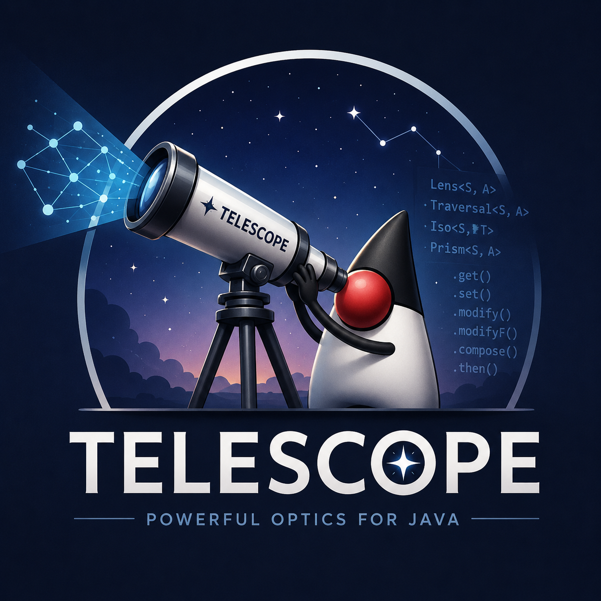

<p align="center">
  
</p>

# telescope

**Build a typed path through your nested data — then read, update, or convert through it. Bidirectionally. One line.**

Works on Java records, POJOs, and Lombok `@Data` classes. Compile-time codegen is optional. Spring Boot starter and
Quarkus extension ship as separate artifacts.

[](https://openjdk.org/projects/jdk/17/)
[](https://github.com/eschizoid/telescope/actions/workflows/ci.yaml)
[](https://codecov.io/gh/eschizoid/telescope)
[](https://central.sonatype.com/artifact/io.github.eschizoid/telescope-core)
[](https://javadoc.io/doc/io.github.eschizoid/telescope-core)
[](https://opensource.org/licenses/Apache-2.0)

---

## Install

```kotlin
// Gradle (Kotlin DSL)
dependencies {
  implementation("io.github.eschizoid:telescope-core:1.0.4")
}
```

```xml
<!-- Maven -->
<dependency>
  <groupId>io.github.eschizoid</groupId>
  <artifactId>telescope-core</artifactId>
  <version>1.0.4</version>
</dependency>
```

That's the runtime. Compile-time codegen, Spring Boot starter, Quarkus extension, and JPMS setup are
[listed below](#additional-artifacts).

---

## First 5 minutes

You have nested data and you want to update a field deep inside without writing copy constructors:

```java
record Address(String city, String zip) {}

record User(String name, Address address) {}

// 1. Build a typed path once.
final var userCity = Telescope.of(User.class).field(User::address).field(Address::city);

// 2. Use it for reading, updating, anything else.
String city = userCity.read(alice); // → "Springfield"

User shouted = userCity.update(alice, String::toUpperCase); // → city becomes "SPRINGFIELD"
```

That's the whole model. Every other capability — mapping between types, navigating containers, lifting through
async/validation effects — is the same path with a different terminal method.

**What's next:**

- Navigate `List<X>` / `Optional<X>` / `Map<K, V>` → [Cookbook](#cookbook)
- Convert between types (record↔record, POJO↔record) → [Type conversion](#type-conversion)
- Lift through async / validated / either / optional effects → [Effects](#effects)
- Compile-time-bound navigators for hot paths →
  [Compile-time codegen](#compile-time-reflection-free-navigation-focus--beanfocus)

---

## Picking your entry point

Two questions decide it: are you working with **records** or **POJOs**, and do you want to **navigate** one type in
place or **convert** between two types?

| You want to…                          | Records                                       | POJOs                                | POJO ⇄ record                                  |
| ------------------------------------- | --------------------------------------------- | ------------------------------------ | ---------------------------------------------- |
| **Navigate & update** in place        | `Telescope.of(R.class)`                       | `Telescope.ofBean(P.class)`          | bridge first (below), then navigate the record |
| **Convert / map** between two types   | `Telescope.map(A.class, B.class, to(...), …)` | `Telescope.map(A.class, B.class, …)` | `Telescope.map(P.class, R.class, …)`           |
| **Reflection-free** (compile-checked) | `@Focus` (navigate)                           | `@BeanFocus` (navigate)              | `@Bridge` (convert, any pair)                  |

Conversions are bidirectional `Iso`s, so any cell in the middle row composes into a longer navigation path with
`.then(...)`. Mismatched names get an explicit `Mapping.to(srcAccessor, tgtAccessor)` row in the `Telescope.map(...)`
call; classes the auto-detect can't handle get a `WriteHint.writeBean(target, strategy)` row. Both are covered under
[Working with POJOs](#working-with-pojos).

---

## More 30-second vignettes

### Records

```java
import io.github.eschizoid.telescope.Telescope;

record Address(String city, String zip) {}

record User(String name, int age, String email, Address address) {}

record Team(String name, List<User> users) {}

record Department(String name, List<Team> teams) {}

record Company(String name, List<Department> departments) {}
```

One task — lowercase every user's email in the whole company tree — done both ways.

#### Without telescope

```java
final Company lowered = new Company(
  company.name(),
  company
    .departments()
    .stream()
    .map((d) ->
      new Department(
        d.name(),
        d
          .teams()
          .stream()
          .map((t) ->
            new Team(
              t.name(),
              t
                .users()
                .stream()
                .map((u) -> new User(u.name(), u.age(), u.email().toLowerCase(), u.address()))
                .toList()
            )
          )
          .toList()
      )
    )
    .toList()
);
```

#### With telescope

```java
final Telescope<Company, String> emails = Telescope.of(Company.class)
  .each(Company::departments)
  .each(Department::teams)
  .each(Team::users)
  .field(User::email);

final Company lowered = emails.update(company, String::toLowerCase);
```

~25 lines of manual reconstruction — every constructor enumerated, every untouched field threaded through by hand —
versus one reusable path. And the path isn't single-use:

```java
emails.toList(company);   // List<String> of every email
emails.count(company);    // how many
```

### Mapping

Same tree, now translate `Company` to a partner-facing `CompanyDto` with a few renamed fields — **one definition, both
directions**:

```java
record AddressDto(String town, String postalCode) {}

record UserDto(String fullName, int age, String email, AddressDto address) {}

record TeamDto(String name, List<UserDto> users) {}

record DepartmentDto(String name, List<TeamDto> teams) {}

record CompanyDto(String name, List<DepartmentDto> departments) {}

final Mapper<Company, CompanyDto> dtoMapper = Telescope.mapper(
  Company.class,
  CompanyDto.class,
  to(User::name, UserDto::fullName), // rename, applies everywhere User↔UserDto recurses
  to(Address::city, AddressDto::town),
  to(Address::zip, AddressDto::postalCode)
);

final CompanyDto dto = dtoMapper.forward(company);

final Company restored = dtoMapper.backward(dto); // ← bidirectional from one definition
```

Same-name fields auto-recurse (`User::email`, `User::age`, all the list/tree wiring). You only name what changes.
MapStruct needs a second `@Mapper` interface for the inverse direction; telescope does not.

Need a flat field to land at a nested target leaf — MapStruct's `@Mapping(source = "flat", target = "a.b.c")`? The
codegen-emitted navigator is a first-class argument to `Mapping.to(...)`:

```java
Telescope.mapper(Cart.class, CartDto.class,
  to(Cart::customerName, CartDtoTelescope.of().shipping().recipient().fullName()));
```

Every hop is typed; `javac` and the IDE refactor follow each step.

Need eager literals or per-call computed values stamped at the target — MapStruct's `@Mapping(constant = "...")` and
`@Mapping(expression = "java(...)")`? Declared in the same `Telescope.mapper(...)` call:

```java
Telescope.mapper(Order.class, OrderDto.class,
  to(Order::id,                OrderDto::id),
  constant(OrderDto::tenant,   "production"),       // eager literal
  compute (OrderDto::createdAt, Instant::now),      // fresh per call
  compute (OrderDto::traceId,   UUID::randomUUID),
  compute (OrderDto::metadata,  HashMap::new));     // fresh container per call
```

`constant` captures once at row construction; `compute` invokes the supplier each forward call (the right choice
whenever a literal would share one mutable reference — `HashMap::new`, `Instant::now`, `UUID::randomUUID`). Both are
forward-only by design; backward direction silently drops the slot, matching MapStruct semantics.

### Beans

POJOs don't need a mirror record. Navigate the bean directly with `ofBean`; `set`/`update` rebuild it immutably, so the
original is never mutated:

```java
class Address {
  /* getCity()/setCity(), getZip()/setZip() */
}

class User {
  /* getName(), getAddress() + setters */
}

final User moved = Telescope.ofBean(User.class)
  .field(User::getAddress)
  .field(Address::getCity)
  .update(user, String::toUpperCase); // new User; `user` untouched
```

Prefer to stay in records? Convert a POJO with `Telescope.map(Pojo.class, Record.class, ...)` and navigate that — see
[Working with POJOs](#working-with-pojos).

That's the library. No `Iso`, `Lens`, `Prism`, `Affine`, `Traversal`, `Getter`, `Setter`, `Fold` in user-facing code.

---

## Examples

Five runnable demos cover the surface — pick the one matching what you're evaluating:

| Module                                                                         | Stack                         | Pick when                                                                                                     |
| ------------------------------------------------------------------------------ | ----------------------------- | ------------------------------------------------------------------------------------------------------------- |
| [`examples/library/`](examples/library/)                                       | plain Java, no framework      | You want to see what the DSL does in isolation — 10 atomic capability demos (`*Demo.java` mains)              |
| [`examples/springboot/order-jpa/`](examples/springboot/order-jpa/)             | Spring Boot + JPA + Hibernate | You want the kitchen sink — eight endpoints, one realistic `Order` domain, every telescope angle on one stack |
| [`examples/springboot/product-starter/`](examples/springboot/product-starter/) | Spring Boot autoconfig        | You want zero-wiring registry discovery — drop `@Bean Mapper<A, B>` declarations and the starter indexes them |
| [`examples/springboot/org-chart/`](examples/springboot/org-chart/)             | Spring Boot + JPA cycles      | You have a self-referencing domain (org charts, threads, graphs) and want to see cycle-safe mapping           |
| [`examples/springboot/invoicing/`](examples/springboot/invoicing/)             | `@Bridge` codegen             | You want zero-reflection compile-time-bound conversion on a hot path                                          |

**Where to start.** If you're evaluating telescope and want the broadest view of what it can do, lead with
[`order-jpa/`](examples/springboot/order-jpa/) — it's the kitchen sink. If you want to see telescope without any
framework wrapping it, browse [`examples/library/`](examples/library/) first. The other three Spring Boot demos are
focused follow-ups for specific concerns.

See [`examples/springboot/README.md`](examples/springboot/README.md) for the full per-module guide with endpoint maps,
capability lists, vs-MapStruct callouts, and benchmark cross-links.

---

## What it is _not_

- **Not a MapStruct replacement, but the mapping surface is roughly at parity.** MapStruct emits one hand-tuned method
  body per type pair and is still ~1.5–2× faster on flat-pair dispatch — about 1.8 ns absolute on a 5-field conversion.
  On deeper workloads (nested records with list-of-records inside) the two engines match. See
  [Performance honesty](#performance-honesty).

  Telescope covers the common `@Mapping(...)` shapes — same-name auto, renames, typed transforms, nested mappers, flat →
  nested-path correspondences, eager literals, per-call computed values, forward-only mappers, multi-source merge,
  by-name enum mapping, null-coalescing defaults, lifecycle hooks, and Spring/Quarkus autoconfig — plus the shapes
  MapStruct can't compose to: deep navigation, effectful update, sealed-root dispatch, JPA cycles and Hibernate `LAZY`
  proxy unwrap, bidirectional from one declaration. See [How it compares to MapStruct](#how-it-compares-to-mapstruct)
  for the full row-by-row comparison and [When telescope is the right pick](#when-telescope-is-the-right-pick) for the
  short version.

- **Not a fuzzy auto-mapper.** `Telescope.map(...)` matches fields by exact name and type, nothing more — no fuzzy name
  heuristics, no flattening, no inferred relationships (that's ModelMapper / Dozer territory, and they lost to MapStruct
  for good reasons). Anything that isn't an exact name match you declare yourself with a `Mapping.to(srcAcc, tgtAcc)` or
  `Mapping.via(srcAcc, tgtAcc, nestedMapper)` row.
- **Not category theory.** Internally it's a Monocle-style Traversal, but `Iso`, `Lens`, `Prism`, `Affine`, and
  `Traversal` are all package-private behind a JPMS boundary. You read, write, update, traverse, convert, and lift
  through one `Telescope<S, A>` type — you never have to type the academic words.

---

## How it compares to MapStruct

MapStruct and telescope solve overlapping but distinct problems. MapStruct is a **mapping framework** — purpose-built
for flat `Entity → Dto` conversion with hand-tuned `@Mapping` expressions, lifecycle hooks, and component-model
integration. Telescope is an **optics DSL** where mapping is one capability among navigation, deep updates, effectful
update, and sealed-type narrowing. They overlap on the deep record↔record / bean↔record / bean↔bean band; the rest of
each tool's surface doesn't.

| Capability                                   | telescope                                                                                                                                          | MapStruct                                                  |
| -------------------------------------------- | -------------------------------------------------------------------------------------------------------------------------------------------------- | ---------------------------------------------------------- |
| **Bidirectional out of the box**             | Every `Mapping.to(srcAcc, tgtAcc)` row works both ways via `Mapper.forward(...)` / `.backward(...)`                                                | One direction per `@Mapper` interface; reverse is separate |
| **Deep nested navigation + update**          | `Telescope.of(C).each(C::depts).field(D::address).update(c, fn)`                                                                                   | Not in scope                                               |
| **Effectful update**                         | `updateAsync` / `updateOptional` / `updateEither` / `updateValidated`                                                                              | Not in scope                                               |
| **Compile-time codegen**                     | `@Focus` / `@BeanFocus` / `@Bridge` annotation processors                                                                                          | `@Mapper` interfaces                                       |
| **Runtime path (no codegen required)**       | `Telescope.of(Class)` with reflective metadata probe; users can opt into `@Focus` later                                                            | Compile-time only                                          |
| **Sealed types / pattern matching**          | `.as(Subtype.class)` narrows; the path stays type-safe                                                                                             | Not in scope                                               |
| **Sealed-root dispatch**                     | `Match.of(...).when(Case.class, ...).exhaustive()` — compile-checked permit list, lattice-routed via `Prism.downcast()`                            | Not in scope                                               |
| **Multi-source mappers (N → 1)**             | `Telescope.merge(Target.class, from(A::id, T::id), …)` returning `Mapper<Sources, T>` with a class-keyed `Sources` bag                             | Multi-source methods with `@Mapping(source = "param.x")`   |
| **Forward-only mappers**                     | `Telescope.mapperForward(...)` returning typed `ForwardMapper<A, B>` — no `backward` method at the type level                                      | Write a separate `@Mapper` interface                       |
| **Enum value mapping**                       | `Mapping.enumTo(src, tgt, SrcEnum.class, TgtEnum.class)` with build-time exhaustiveness                                                            | `@ValueMapping(source = "X", target = "Y")`                |
| **Null-coalescing defaults**                 | `Mapping.toOrElse(src, tgt, default)` / `toOrElseGet(src, tgt, supplier)` (predicate-gated overload)                                               | `@Mapping(defaultValue = "...")` / `defaultExpression`     |
| **Conditional / drop**                       | `Mapping.drop(src)` skips the field; predicate-gated `toOrElse(src, tgt, Predicate, default)` for value-conditional fallback                       | `@Mapping(condition = "...")`                              |
| **`@BeforeMapping` / `@AfterMapping` hooks** | `Mapper.beforeForward(...)` / `afterForward(...)` / `beforeBackward(...)` / `afterBackward(...)` — chain composes left-to-right                    | Annotation-driven                                          |
| **Spring / Quarkus / CDI integration**       | `telescope-spring-boot-starter` (Spring Boot 4 autoconfig + `Mapper<A, B>` bean registry) + `telescope-quarkus` (Arc extension, Jandex-discovered) | Native via `componentModel = "spring"` / `"jsr330"` / etc. |
| **Maturity**                                 | 1.0 line; JMH-backed perf claims                                                                                                                   | Ten years; thousands of production deployments             |
| **Dispatch perf — codegen vs codegen**       | 1.2–1.9× behind on flat/nested forward; **matches on the deep tier** — see Performance honesty below for the measured numbers                      | Direct bytecode, monomorphic call site                     |

#### Per-field source/target mapping — side by side

The bread-and-butter MapStruct call — `@Mapping(source="x", target="y")` — has a direct telescope equivalent. The two
look alike on purpose; the differences are where the safety lives.

```java
// MapStruct
@Mapper
public interface OrderMapper {
  @Mapping(source = "customerName", target = "fullName")
  @Mapping(source = "createdAt", target = "createdDate")
  OrderDto toDto(Order order);
}
```

```java
// telescope — varargs factory
final var mapper = Telescope.mapper(
  Order.class,
  OrderDto.class,
  Mapping.to(Order::getCustomerName, OrderDto::getFullName),
  Mapping.to(Order::getCreatedAt, OrderDto::getCreatedDate)
);

// Same-named fields backfill automatically — recursion is auto by default, no explicit row needed.

final OrderDto dto = mapper.forward(order);

final Order back = mapper.backward(dto);
```

`Telescope.map(...)` is the sibling that returns a `Telescope<A, B>` instead of a `Mapper<A, B>` — same factory shape,
same row vocabulary, useful when you want to thread the conversion into a longer `.then(...)` chain rather than call
`forward` / `backward` / `patch` on a Mapper handle.

| Aspect                               | MapStruct                                               | telescope                                                                  |
| ------------------------------------ | ------------------------------------------------------- | -------------------------------------------------------------------------- |
| **Source / target syntax**           | Strings: `"customerName"`                               | Typed method references: `Order::getCustomerName`                          |
| **Typo / type-mismatch caught at**   | Annotation-processor run                                | **`javac` compile time** — the wrong-type accessor doesn't compile         |
| **Survives a rename (IDE refactor)** | String breaks; processor re-runs and surfaces the error | IDE refactor follows the accessor everywhere                               |
| **Reverse direction**                | A second method with `@InheritInverseConfiguration`     | Same `Mapping.to(...)` row works both ways                                 |
| **Nested path** (`source = "a.b.c"`) | Expression-string                                       | `Mapping.via(srcAcc, tgtAcc, nestedMapper)` — typed at every hop           |
| **Custom expression**                | `@Mapping(expression = "java(...)")`                    | `Mapping.via(srcAcc, tgtAcc, customMapper)` — plain Java mapper, type-safe |
| **`condition = "..."` predicate**    | Annotation attribute                                    | `Edit.overIfPresent(...)` for updates; `Mapping.drop(...)` for mappings    |

The intent is identical; the calculus is different. MapStruct trades the typed-ref ergonomics for the ability to express
things like `source = "user.address.street"` as a single string. Telescope trades the string-path brevity for the
guarantee that everything you wrote against the source/target types compiles iff it still makes sense.

#### When MapStruct is the right pick

- You need embedded expression-language mapping bodies — `@Mapping(expression = "java(...)")` or
  `@Mapping(qualifiedByName = "...")` qualifier dispatch — and want them inline in the annotation rather than as plain
  Java mappers passed to `Mapping.via(...)`
- You need MapStruct-specific declarative shapes telescope doesn't expose: `@InheritConfiguration` row-set reuse, full
  `@SubclassMapping` polymorphic dispatch, or `@MappingTarget` update-in-place semantics (telescope's `Mapper.patch`
  covers sparse overlay, not full update-into-existing)
- The mappers are flat `Entity → Dto` only — no bidirectional, deep navigation, sealed dispatch, multi-source merge, or
  effectful update needs — and you'd never reach for optics for anything else

#### When telescope is the right pick

- Your problem includes **deep navigation** alongside mapping —
  `Telescope.of(Company.class).each(Company::departments).field(Department::address).update(c, fn)` — and you don't want
  a separate mapper for every level
- You need **bidirectional** out of one definition — `Mapper.forward(...)` and `.backward(...)` derive from the same row
  list, no inverse interface to write
- You need to lift a mapping (or a field update) through an **effect** — `updateValidated`, `updateAsync`,
  `updateOptional`, `updateEither`
- You have **multi-source mappers** (`N → 1`) — `Telescope.merge(Target.class, from(A::id, T::id), …)` returns a
  `Mapper<Sources, T>` with a class-keyed bag; declared once, reusable
- You have a **sealed root** to dispatch on — `Match.of(animal).when(Dog.class, …).when(Cat.class, …).exhaustive()`
  gives compile-checked exhaustiveness over the permit list (and the `@Bridge` codegen emits exactly this for sealed
  source types)
- You're navigating a mix of **records and POJOs** at any depth and don't want to materialize intermediate DTOs to
  bridge between them
- You want the same `Telescope<S, A>` type to do reading, updating, mapping, and conversion — one mental model instead
  of separate libraries

#### Performance honesty

Apples-to-apples ([`MapStructComparisonBenchmark`](benchmarks/README.md#mapstruct-comparison-apples-to-apples), JDK 25,
Apple Silicon, 3 warmup + 5 measurement × 1 fork) on identical fixture shapes across three depth tiers and both
directions:

| Tier   | Direction     | MapStruct (ns/op) | Telescope codegen (ns/op) | Telescope runtime (ns/op) |
| ------ | ------------- | ----------------: | ------------------------: | ------------------------: |
| flat   | bean → record |     3.350 ± 0.021 |             4.863 ± 0.025 |            103.45 ± 1.277 |
| flat   | record → bean |     3.368 ± 0.047 |             5.881 ± 0.055 |            170.27 ± 0.637 |
| nested | bean → record |     5.165 ± 0.564 |            10.168 ± 0.150 |           165.98 ± 12.280 |
| nested | record → bean |     5.241 ± 0.070 |            10.476 ± 0.087 |            225.20 ± 4.311 |
| deep   | bean → record |     47.60 ± 0.293 |            57.565 ± 1.206 |            573.32 ± 3.146 |
| deep   | record → bean |     53.37 ± 7.532 |            54.285 ± 1.353 |            880.62 ± 6.571 |

All 18 rows captured on a freshly-rebooted machine, no other workloads running. Tight error bands across the board
(typically ±0.02–7 ns; one outlier at ±12 ns on nested runtime forward).

Three tiers, codegen path. On flat, MapStruct hits 3.35 ns and telescope 4.86 ns — a 1.45× gap, 1.5 ns absolute. On
nested, 5.17 vs 10.17 ns: 1.97× behind, 5.0 ns absolute. On deep, 47.60 vs 57.57 ns: 1.21× behind on forward. Once
per-level work climbs past ~50 ns, the wrapper hop vanishes into the actual work; on the backward direction at 53.37 vs
54.29 ns the two are within each other's error bands.

The flat-tier gap is the `Telescope` wrapper's single virtual hop into `BridgeFn.forward` — about 1.5 ns of constant
overhead vs MapStruct's directly-inlined constructor call. On a 3 ns workload that's a noticeable surcharge. On a 50 ns
workload it vanishes, which is what we see on the deep tier where element-by-element list conversion dominates.

The runtime path sits on a position-indexed `Object[]` structural intermediate — `DeepMap.assembleIso` builds a single
fused `Iso<S, T>` that gathers directly from cached LMF-bound readers into the target array, no intermediate allocation.
The cycle-safe shell at every nested type-pair hop bypasses its `ThreadLocal` + `IdentityHashMap` probe when the static
type graph is acyclic (detected during `populateIso` via SCC analysis on the recursion stack); genuine instance cycles
still get the full guard. Cumulative drop vs the unoptimized baseline: **~70-83%** across every row (e.g. flat bean →
record: 340 → 103 ns/op; deep bean → record: 2024 → 573 ns/op). Relative gap to MapStruct: ~31× on flat, ~32× on nested,
**~12× on deep** — the deeper the tree, the more the per-level work dominates the constant overhead. Sub-microsecond on
flat and nested, single-microsecond on deep. Allocation pressure is low enough to fit comfortably in non-hot service
code; codegen remains the recommendation on tight inner loops.

If you're in a tight inner loop where 1 ns matters, pick MapStruct. For realistic deep workloads — nested records with
list-of-records inside — the codegen rows are a tie and you're picking on capability. Sealed-narrow paradigm hop,
effectful update (`updateAsync`, `updateValidated`), JPA cycles, Hibernate `LAZY` proxy unwrap, deep navigation as a
primitive: MapStruct can't compile any of it, so the question doesn't really come up. The
[`examples/springboot/`](examples/springboot) directory has end-to-end demos.

---

## Additional artifacts

Published to Maven Central under `io.github.eschizoid`. The six artifacts in the family:

| Artifact                        | Role                                                                                                                                                                |
| ------------------------------- | ------------------------------------------------------------------------------------------------------------------------------------------------------------------- |
| `telescope-core`                | The DSL — `Telescope`, `Mapper`, `Mapping`, `Either` / `Validated`, annotations. The one you add for the runtime path.                                              |
| `telescope-internal`            | Optic lattice + reflection helpers. Transitive only — pulled in automatically; users cannot reference it (JPMS qualified exports block visibility at compile time). |
| `telescope-codegen`             | Optional `@Focus` / `@BeanFocus` / `@Bridge` annotation processor — see [Compile-time field navigation](#compile-time-reflection-free-navigation-focus--beanfocus). |
| `telescope-lombok`              | Lombok-aware variant of the processor for `@Data` / `@Value` / `@Builder` POJOs.                                                                                    |
| `telescope-spring-boot-starter` | Spring Boot 4 autoconfig + `Mapper<A, B>` bean registry.                                                                                                            |
| `telescope-quarkus`             | Quarkus 3 CDI extension with the same registry shape.                                                                                                               |

### Compile-time `@Focus` codegen (optional)

Add the processor only if you use the `@Focus` path. It's inert otherwise — the annotation is source-retention.

Gradle (Kotlin DSL):

```kotlin
dependencies {
    implementation("io.github.eschizoid:telescope-core:1.0.4")
    annotationProcessor("io.github.eschizoid:telescope-codegen:1.0.4")
}
```

Maven:

```xml
<dependency>
  <groupId>io.github.eschizoid</groupId>
  <artifactId>telescope-core</artifactId>
  <version>1.0.4</version>
</dependency>

<build>
  <plugins>
    <plugin>
      <groupId>org.apache.maven.plugins</groupId>
      <artifactId>maven-compiler-plugin</artifactId>
      <configuration>
        <annotationProcessorPaths>
          <path>
            <groupId>io.github.eschizoid</groupId>
            <artifactId>telescope-codegen</artifactId>
            <version>1.0.4</version>
          </path>
        </annotationProcessorPaths>
      </configuration>
    </plugin>
  </plugins>
</build>
```

#### Annotation processor ordering with Lombok

When both Lombok and `telescope-lombok` / `telescope-codegen` sit on the annotation processor path, list **Lombok
first**. Maven respects the declaration order of `<annotationProcessorPaths>`; Gradle respects the order of
`annotationProcessor(...)` calls:

```xml
<annotationProcessorPaths>
  <path>
    <groupId>org.projectlombok</groupId>
    <artifactId>lombok</artifactId>
    <version>1.18.30</version>
  </path>
  <path>
    <groupId>io.github.eschizoid</groupId>
    <artifactId>telescope-lombok</artifactId>
    <version>1.0.4</version>
  </path>
</annotationProcessorPaths>
```

```kotlin
dependencies {
  annotationProcessor("org.projectlombok:lombok:1.18.30")
  annotationProcessor("io.github.eschizoid:telescope-lombok:1.0.4")
  annotationProcessor("io.github.eschizoid:telescope-codegen:1.0.4")
}
```

Both `BridgeProcessor` and `LombokFocusProcessor` round-defer emission to `processingOver()` when they detect that the
host class (or its `@Bridge` target) carries a Lombok-synthesizing annotation, so the build is order-tolerant — but
explicit ordering avoids relying on round-deferral and is the recommended posture. The Lombok-synthesizing trigger set
includes `@Data`, `@Value`, `@Builder`, `@Getter`, `@Setter`, the three `*ArgsConstructor` variants, `@SuperBuilder`,
and `@experimental.Accessors`.

Symptoms of mis-ordering without round-deferral (now harmless thanks to the deferral fix, but worth recognizing on older
versions): an emitted `<X>Bridge` whose `forward`/`backward` are no-ops, or a `@Data` class for which no `<X>Telescope`
lands. Both mean the telescope processor ran before Lombok patched the host class.

### JPMS / modular consumers

If your project has a `module-info.java`, add the `requires` and, for the runtime navigation path, an `opens` for the
package containing your records / beans / POJOs:

```java
module com.acme.app {
  requires io.github.eschizoid.telescope;

  // Only needed if you use the RUNTIME path (Telescope.of, .ofBean, .map, .mapper).
  // The codegen path (@Focus / @BeanFocus / @Bridge) needs no opens.
  opens com.acme.model to io.github.eschizoid.telescope;
}
```

The `opens` target is **your** package — the one telescope needs to reach into — not telescope's. Runtime navigation
binds accessors via `MethodHandles.privateLookupIn(yourClass, MethodHandles.lookup())` and feeds the handles to
`LambdaMetafactory` for hot-path dispatch. Without an `opens`, the lookup fails with `IllegalAccessException`, surfaced
as:

> `Cannot access <YourClass> ... to build LambdaMetafactory <kind>. Add 'opens <pkg> to io.github.eschizoid.telescope;' to that module's module-info.java.`

Copy the package from the error message into the `opens` directive.

`telescope-internal` comes in transitively via `telescope-core`'s module declaration, but its packages are
qualified-exported to `telescope-core` only, so you cannot accidentally reference internal lattice types from your own
code. `telescope-codegen` is compile-time-only and isn't on the runtime module path.

**Codegen escape hatch.** The `@Focus` / `@BeanFocus` / `@Bridge` processors emit compile-time navigators that read
components and call constructors / builders / setters directly — no `privateLookupIn`, no `LambdaMetafactory`, no
`opens` requirement. If adding the `opens` is awkward (e.g. a downstream module you don't own), the codegen path
sidesteps the JPMS constraint entirely. See
[Compile-time, reflection-free navigation](#compile-time-reflection-free-navigation-focus--beanfocus).

**Classpath users (no `module-info.java`).** No `opens` needed — the JVM grants unnamed-module access automatically.
This section is JPMS-only.

---

## The DSL surface

A single class, `Telescope<S, A>`, where `S` is the root type and `A` is the leaf you focus on. The full method
inventory lives here as a reference; pick what you need by what you're trying to do, not by reading top-to-bottom.

### Build

| Method                                                             | What it does                                                                                                                                                                                                                                                                                                                                                                                                                                                                                                                                      |
| ------------------------------------------------------------------ | ------------------------------------------------------------------------------------------------------------------------------------------------------------------------------------------------------------------------------------------------------------------------------------------------------------------------------------------------------------------------------------------------------------------------------------------------------------------------------------------------------------------------------------------------- |
| `Telescope.of(Class<S>)`                                           | Start at the root type.                                                                                                                                                                                                                                                                                                                                                                                                                                                                                                                           |
| `Telescope.lens(getter, setter)`                                   | Build a single-focus telescope directly, no reflection. Used by `@Focus` codegen; handy for hot paths.                                                                                                                                                                                                                                                                                                                                                                                                                                            |
| `Telescope.from(A).to(B).using(fwd, back)`                         | Build a `Telescope<A, B>` backed by an `Iso` — bidirectional type conversion that composes into longer paths.                                                                                                                                                                                                                                                                                                                                                                                                                                     |
| `Telescope.map(A.class, B.class, MapStep...)`                      | **Recommended.** Deep recursive mapping for any combination of records and POJOs (record↔record, POJO↔POJO, cross-paradigm at any depth). Same-name components identity-map, nested records/beans recurse, `List`/`Set`/`Map`/`Optional` lift the inner Iso through the container automatically. Override rows (`Mapping.to`, `Mapping.via`) and write-strategy hints (`WriteHint.writeBean(target, strategy)`) apply at any depth where their type pair appears. Sibling `Telescope.mapper(...)` returns `Mapper<A, B>`.                         |
| `Telescope.ofBean(Class<P>)`                                       | Start a native POJO telescope — `.field`/`.each` navigate the bean directly, rebuilding via strategy (see [Working with POJOs](#working-with-pojos)).                                                                                                                                                                                                                                                                                                                                                                                             |
| `.field(Class::accessor)`                                          | Descend into a record field via method reference. **Compile-checked.**                                                                                                                                                                                                                                                                                                                                                                                                                                                                            |
| `.fieldByName(String)`                                             | Descend by field name — the runtime escape hatch for late-binding (config-driven paths). **Runtime-checked:** wrong name → runtime error.                                                                                                                                                                                                                                                                                                                                                                                                         |
| `.fieldByName(String, Class<B>)`                                   | Same as above with an inline type witness for cleaner `var` inference. The `Class<B>` is inference sugar, **not validated** against the actual field.                                                                                                                                                                                                                                                                                                                                                                                             |
| `.each(Class::collectionAccessor)`                                 | Descend into a `List`/`Set`/`Iterable` field and broadcast over elements. Element type inferred from the method ref. **Compile-checked.**                                                                                                                                                                                                                                                                                                                                                                                                         |
| `.list(Class::accessor)` / `.setField` / `.mapField` / `.optional` | Typed-container variants: keep the container type for later traversal. Return `ListTelescope<S, X>` / `SetTelescope<S, X>` / `MapTelescope<S, K, V>` / `OptionalTelescope<S, X>` — sealed subclasses of `Telescope` whose typed terminal (`.each()` / `.values()` / `.present()`) descends into elements via pure lattice composition. **Compile-checked, no runtime dispatch.** `setField` / `mapField` (1.0 rename) disambiguate from the write terminal `set(S, A)` and the static deep-conversion factory `Telescope.map(Class, Class, ...)`. |
| `Telescope.asList(path)` / `asSet` / `asMap` / `asOptional`        | Promote a pre-built `Telescope<S, List<X>>` (or `Set`/`Map`/`Optional`) into the typed subclass so the compile-checked terminal becomes available. Useful when composing path fragments.                                                                                                                                                                                                                                                                                                                                                          |
| `.eachValue(Class::mapAccessor)`                                   | Like `each`, but for `Map` values (keys preserved).                                                                                                                                                                                                                                                                                                                                                                                                                                                                                               |
| `.whenPresent(Class::optionalAccessor)`                            | Like `each`, but for `Optional` — no-op if empty.                                                                                                                                                                                                                                                                                                                                                                                                                                                                                                 |
| `.as(Class)`                                                       | Narrow to a sealed-type case. Non-matching values pass through.                                                                                                                                                                                                                                                                                                                                                                                                                                                                                   |
| `.filter(Predicate)`                                               | Restrict to elements matching the predicate.                                                                                                                                                                                                                                                                                                                                                                                                                                                                                                      |
| `.then(otherTelescope)`                                            | Compose two telescopes.                                                                                                                                                                                                                                                                                                                                                                                                                                                                                                                           |

### Read

| Method         | Returns                                                                                                                                                                                                                                                                                      |
| -------------- | -------------------------------------------------------------------------------------------------------------------------------------------------------------------------------------------------------------------------------------------------------------------------------------------- |
| `.read(S)`     | The first focused value. Throws if absent.                                                                                                                                                                                                                                                   |
| `.find(S)`     | `Optional<A>` of the first focused value.                                                                                                                                                                                                                                                    |
| `.toList(S)`   | `List<A>` of all focused values.                                                                                                                                                                                                                                                             |
| `.count(S)`    | How many values are focused.                                                                                                                                                                                                                                                                 |
| `.exists(S)`   | `true` if there's at least one.                                                                                                                                                                                                                                                              |
| `.withIndex()` | Index-aware chainable view (`Telescope.WithIndex<S, A>`). Exposes `.update(S, BiFunction<Integer, A, A>)`, `.toList(S)` → `List<Indexed<A>>`, `.find(S)`, `.count(S)`, `.exists(S)` — the same operations as the parent, with each focused value paired with its 0-based traversal position. |

### Write

| Method                                         | Returns                                                                                                                                                |
| ---------------------------------------------- | ------------------------------------------------------------------------------------------------------------------------------------------------------ |
| `.set(S, A)`                                   | New `S` with every focused value replaced by the given one.                                                                                            |
| `.update(S, Function<A, A>)`                   | New `S` with every focused value transformed.                                                                                                          |
| `.updateAsync(S, fn, Executor)`                | Bounded-concurrency async update; pass a fixed pool to cap concurrent invocations.                                                                     |
| `.updateIndexed(S, BiFunction<Integer, A, A>)` | Transform every focused value with its 0-based position in traversal order.                                                                            |
| `.toListIndexed(S)`                            | `List<Indexed<A>>` — every focused value paired with its position.                                                                                     |
| `.update(Telescope<S, X>, Function<X, X>)`     | Accumulate an edit through a pre-built path; returns `Telescope<S, S>` carrying the running chain. See [Multi-edit](#multi-edit). **Compile-checked.** |
| `.with(Function<A, A>)`                        | Accumulate an edit at the current focus (inline-path equivalent of `.update(path, fn)`); returns `Telescope<S, S>`. **Compile-checked.**               |
| `.apply(S)`                                    | Run every accumulated `.update(path, fn)` / `.with(fn)` edit against the source, in insertion order. Returns a new `S`.                                |

Multi-edit packing (static factories — see [Multi-edit](#multi-edit)):

| Method                                       | Returns                                                                                                                           |
| -------------------------------------------- | --------------------------------------------------------------------------------------------------------------------------------- |
| `Telescope.all(Edit<S>...)`                  | Reusable `Telescope<S, S>` normalizer that runs every edit, in argument order, on `apply(s)`. **Compile-checked.**                |
| `Edit.over(Telescope<S, X>, Function<X, X>)` | Pair a pre-built path with its per-leaf transformation. Static-import-friendly: `import static …Edit.over;`. **Compile-checked.** |

---

## Cookbook

### A single field

```java
final Telescope<User, String> name = Telescope.of(User.class).field(User::name);

name.read(alice);                        // "alice"
name.set(alice, "Bob");                  // User with name="Bob"
name.update(alice, String::toUpperCase); // User with name="ALICE"
```

### Nested fields

```java
final Telescope<User, String> city = Telescope.of(User.class)
        .field(User::address)
        .field(Address::city);

city.update(alice, String::toUpperCase);
```

### Every element of a collection inside a record

```java
final Telescope<Team, String> userNames = Telescope.of(Team.class)
        .each(Team::users)
        .field(User::name);

userNames.update(team, String::toUpperCase);
userNames.toList(team);                       // List<String>
```

### Sealed-type case

```java
sealed interface Event permits Created, Updated, Deleted {}
record Created(String id) implements Event {}
record Updated(String id, String diff, int revision) implements Event {}
record Deleted(String id) implements Event {}

final Telescope<Event, String> updatedDiff = Telescope.of(Event.class)
        .as(Updated.class)
        .field(Updated::diff);

updatedDiff.update(event, s -> s + "!"); // no-op if not Updated
updatedDiff.find(event);                 // Optional<String>
```

### Optional field

```java
record Profile(String id, Optional<String> nickname) {}

final Telescope<Profile, String> nick = Telescope.of(Profile.class).whenPresent(Profile::nickname);

nick.update(profile, String::toUpperCase); // no-op if nickname is empty
```

### Map values

```java
record Index(Map<String, Integer> byKey) {}

final Telescope<Index, Integer> values = Telescope.of(Index.class).eachValue(Index::byKey);

values.update(index, v -> v * 10);
```

### Typed container leaves (pre-built fragments)

When you want a path that ends _at_ the container (not at its elements), use the typed `.list(Class::accessor)` /
`.setField(...)` / `.mapField(...)` / `.optional(...)` instance methods. They return narrower subclasses
(`ListTelescope`, `SetTelescope`, `MapTelescope`, `OptionalTelescope`) whose typed terminal step (`.each()` /
`.values()` / `.present()`) descends into elements with zero runtime container dispatch — pure lattice composition,
fully compile-checked.

```java
record Box(List<String> tags) {}

// Build the list-typed path once; descend on demand.
final ListTelescope<Box, String> tags = Telescope.of(Box.class).list(Box::tags);
final Telescope<Box, String> elements = tags.each(); // typed .each() — compile-checked

elements.update(box, String::toUpperCase);

// Set / Map / Optional follow the same shape.
record Cart(Set<Item> items) {}

final SetTelescope<Cart, Item> items = Telescope.of(Cart.class).setField(Cart::items);
items.each().field(Item::sku).update(cart, String::toUpperCase);
```

For pre-built paths from elsewhere — composed `Telescope.then(...)` fragments, return types of helper methods, etc. —
promote them with `Telescope.asList(...)` / `.asSet(...)` / `.asMap(...)` / `.asOptional(...)` so the typed terminal
becomes available:

```java
final Telescope<Company, List<Department>> raw = ...; // built somewhere else
Telescope.asList(raw).each().field(Department::name).update(co, String::toLowerCase);
```

### Indexed traversal

When a read or update depends on position, not just value, use the indexed forms. The index is the 0-based position in
traversal order (flat across nested `each` levels):

```java
final Telescope<Team, String> members = Telescope.of(Team.class).each(Team::members);

members.toListIndexed(team);                               // [Indexed[0, "alice"], Indexed[1, "bob"], ...]
members.updateIndexed(team, (i, name) -> i + ": " + name); // "0: alice", "1: bob", ...
```

### Filter mid-path

```java
final Telescope<Company, String> engineeringEmails = Telescope.of(Company.class)
        .each(Company::departments)
        .filter(d -> "Engineering".equals(d.name()))
        .each(Department::teams)
        .each(Team::users)
        .field(User::email);

engineeringEmails.update(company, String::toLowerCase);
// Engineering emails lowercased; Sales untouched.
```

### Sealed-case + collection

```java
record Stream(List<Event> events) {}

final Telescope<Stream, Integer> bumpRevisions = Telescope.of(Stream.class)
        .each(Stream::events)
        .as(Updated.class)
        .field(Updated::revision);

bumpRevisions.update(stream, r -> r + 1);
// Created / Deleted events pass through unchanged.
```

### Sibling access

A plain `update` lambda only sees the focused value. When the transform needs sibling fields (the focused price needs
the SKU; the focused user needs the team name), close over the source — it's already in scope, since you pass it as the
first argument.

```java
record Team(String name, List<User> users) {}

record User(String name, String bio) {}

static final Telescope<Team, User> USERS = Telescope.of(Team.class).each(Team::users);

// Set every user's bio to mention the team name. The lambda reads the sibling `team.name()`.
final Team stamped = USERS.update(team, (user) -> new User(user.name(), "Member of " + team.name()));
```

This works for every variant — `updateAsync`, `updateEither`, `updateValidated`, `updateOptional` — because the root the
lambda needs is the same value you already hold. If the source is an expression rather than a variable, hoist it to a
local first (`final var team = fetchTeam();`) and close over that.

### Multi-edit

To apply several edits at different paths in one go, declare each path once as a static final, then pack the edits with
`Telescope.all(over(...), over(...))`. Every step is fully compile-checked.

**Recommended form — `Telescope.all(over(...), over(...))`.** Each `over(PATH, fn)` is one edit; `Telescope.all(...)`
folds them into a reusable `Telescope<S, S>` whose `.apply(s)` runs every edit in argument order.

```java
import static io.github.eschizoid.telescope.Edit.over;

static final Telescope<Company, String> EMAILS = Telescope.of(Company.class)
  .each(Company::departments)
  .each(Department::teams)
  .each(Team::users)
  .field(User::email);

static final Telescope<Company, String> DEPT_NAMES = Telescope.of(Company.class)
  .each(Company::departments)
  .field(Department::name);

static final Telescope<Company, String> USER_NAMES = Telescope.of(Company.class)
  .each(Company::departments)
  .each(Department::teams)
  .each(Team::users)
  .field(User::name);

final Telescope<Company, Company> normalize = Telescope.all(
  over(EMAILS,     String::toLowerCase),
  over(DEPT_NAMES, String::trim),
  over(USER_NAMES, titleCase));

final Company done = normalize.apply(company);
normalize.apply(companyB);   // reusable across sources
```

`over(path, fn)` ties a `Telescope<S, X>` to a `Function<X, X>`; `javac` enforces the leaf type match. Each edit lives
on its own line, the count is visible at a glance, and there is no chain-blur between paths.

**Single-edit shortcut.** For one edit, just call `update` on the path:

```java
EMAILS.update(company, String::toLowerCase);
```

**Chain accumulator (alternative).** The same semantics as `Telescope.all(...)` are also available as a fluent chain via
`.update(path, fn)` and `.with(fn)` terminated by `.apply(source)` — useful when you want an inline path mid-chain
without naming it. The chain reads less clearly for multiple distinct paths (the navigation segments visually blur), so
prefer `Telescope.all(over(...))` when packing two or more edits.

```java
// Equivalent to the Telescope.all(...) form above:
Telescope.of(Company.class)
  .update(EMAILS,     String::toLowerCase)
  .update(DEPT_NAMES, String::trim)
  .update(USER_NAMES, titleCase)
  .apply(company);

// Inline one-shot trailing edit on a pre-built chain:
Telescope.of(Company.class)
  .update(EMAILS, String::toLowerCase)
  .each(Company::departments).field(Department::name).with(String::trim)
  .apply(company);
```

Edits run sequentially in argument / insertion order; the second sees the first's result, not the original source. An
empty `Telescope.all()` (or an unedited chain) returns the source unchanged from `.apply(...)`.

---

## Type conversion

Two records that represent the same data (`Entity ↔ Dto`) convert through a bidirectional `Iso` that composes into
longer paths like any other telescope.

### Hand-written (`from / to / using`)

Write the two conversion functions yourself; telescope doesn't auto-map (that's MapStruct's territory). What's different
is that the conversion becomes a value, so it threads into longer paths.

```java
final Telescope<UserEntity, UserDto> userIso = Telescope.from(UserEntity.class)
  .to(UserDto.class)
  .using((e) -> new UserDto(e.id(), e.email(), e.name()), (d) -> new UserEntity(d.id(), d.email(), d.name()));

UserDto dto = userIso.read(entity); // forward

UserEntity updated = userIso.update(entity, (d) -> new UserDto(d.id(), d.email().toLowerCase(), d.name()));
//                                                                                              ↑ round-trips through DTO, returns Entity
```

The conversion is an `Iso`, which means it composes into longer paths:

```java
record EntityPage(List<UserEntity> items, int total) {}

// Walk into the page, view each entity as a DTO, focus the email, lowercase it.
// Result is an EntityPage with UserEntity items — entities modified by round-tripping through DTO.
Telescope.of(EntityPage.class)
        .each(EntityPage::items)
        .then(userIso)                         // ← Iso participates in the lattice
        .field(UserDto::email)
        .update(page, String::toLowerCase);
```

### Deep recursive mapping (`Telescope.map(A.class, B.class, to(...)...)`)

The recommended shape for record-to-record (and POJO↔POJO, and cross-paradigm) conversion: pass the source and target
classes up front, then varargs of `MapStep` rows. **Recursion is the default.** Same-named components identity-map,
nested records / POJOs recurse, `List<X>↔List<Y>` / `Set<X>↔Set<Y>` / `Map<K, X>↔Map<K, Y>` / `Optional<X>↔Optional<Y>`
lift the inner-element Iso through the container automatically (to any depth — `List<Map<K, Set<X>>>` works by
construction). You only spell the _differences_.

```java
import static io.github.eschizoid.telescope.mapping.Mapping.to;
import static io.github.eschizoid.telescope.mapping.Mapping.via;

// All same-name, no overrides — the pure-copy 1-liner:
final Telescope<UserEntity, UserDto> userMapper = Telescope.map(UserEntity.class, UserDto.class);

// Tree-deep mapping with two renames — every other field figures itself out:
final Telescope<CompanyEntity, CompanyDto> companyMapper = Telescope.map(
  CompanyEntity.class,
  CompanyDto.class,
  to(CompanyEntity::founded, CompanyDto::since), // top-level rename
  to(UserEntity::name, UserDto::fullName)
); // applies wherever User↔UserDto recurses
```

The second example covers a 5-level structure — `Company → Department → Team → User → Address` — with `List`, `Map`, and
`Optional` containers at multiple depths. Both renames are declared _once_; the `User::name → UserDto::fullName` rule
fires _every time_ recursion encounters the `UserEntity ↔ UserDto` type pair (in `users[]`, in
`department.head: Optional<User>`, in `company.ceo: Optional<User>` — all three at once).

**How `to(...)` overrides are keyed.** Each `to(srcAccessor, tgtAccessor)` row carries its source and target record
classes implicitly via the method references. `Telescope.map(...)` reads them via `SerializedLambda` and uses
`(sourceClass, targetClass)` as the key. When the recursion lands on a matching pair, the row's correspondence is
applied; otherwise the recursion auto-resolves that component.

**Cycle handling.** Self-referencing structures (a `User` that contains `Optional<User>`) terminate naturally — the
recursion caches each type pair as it descends, and re-entry returns the in-progress entry instead of recursing forever.

**Override forms.** Static-import-friendly factories on `Mapping`:

| Factory                       | Purpose                                             | MapStruct equivalent                        |
| ----------------------------- | --------------------------------------------------- | ------------------------------------------- |
| `to(src, tgt)`                | Rename, same leaf type                              | `@Mapping(source, target)`                  |
| `to(src, tgt, fwd, bwd)`      | Bidirectional typed transform                       | `@Mapping(source, target, qualifiedBy)`     |
| `forward(src, tgt, fn)`       | Forward-only typed transform                        | (separate `@Mapper` interface)              |
| `toOrElse(src, tgt, default)` | Null-coalesce to a default value                    | `@Mapping(defaultValue = "...")`            |
| `toOrElseGet(src, tgt, sup)`  | Null-coalesce via a `Supplier`                      | `@Mapping(defaultExpression = "java(…)")`   |
| `enumTo(src, tgt, SE, TE)`    | By-name enum mapping with build-time exhaustiveness | `@ValueMapping(source = "X", target = "Y")` |
| `via(src, tgt, mapper)`       | Drop in a pre-built nested mapper                   | (composition by hand)                       |
| `constant(tgt, value)`        | Forward-only literal at the target slot             | `@Mapping(constant = "...")`                |
| `compute(tgt, supplier)`      | Forward-only supplier-computed value                | `@Mapping(expression = "java(...)")`        |
| `drop(src)`                   | Skip the source field; backward zero-fills it       | `@Mapping(ignore = true)`                   |

Example — three of those rows together:

```java
import static io.github.eschizoid.telescope.mapping.Mapping.*;

Telescope.mapper(
  UserEntity.class,
  UserDto.class,
  to(UserEntity::name, UserDto::fullName),
  toOrElse(UserEntity::region, UserDto::region, "EMEA"),
  enumTo(UserEntity::status, UserDto::status, EntityStatus.class, DtoStatus.class)
);
```

The `via(...)` row works in two flavours: pass an **accessor-typed** mapper (e.g.
`Mapper<List<UserEntity>, List<UserDto>>`) and telescope uses it as-is, or pass an **element-typed** mapper
(`Mapper<UserEntity, UserDto>`) and telescope detects the accessor's container shape (`List`, `Set`, `Optional`, `Map`
values) and auto-lifts the mapper through it via `Iso.liftList` / `liftSet` / `liftOptional` / `liftMapValues`. One row
either way — no separate `viaList` / `viaSet` factories.

Recursion is auto by default — there's no `auto()` row to declare.

**Result threads through longer paths** like any other telescope:

```java
Telescope.of(EntityPage.class)
        .each(EntityPage::items)
        .then(companyMapper)
        .field(CompanyDto::name)
        .update(page, String::toUpperCase);   // entities modified by round-tripping through the DTO
```

**`Telescope.mapper(A.class, B.class, ...)` — Mapper sibling.** Same factory, returns `Mapper<A, B>` instead of
`Telescope<A, B>`. Same row syntax; same recursion. Useful for nested-mapper composition via `via(src, tgt, mapper)`.

For lossy or one-way conversions (dropping fields, non-invertible transforms), use `from/to/using` with hand-written
functions. Telescope still won't auto-discover anything fuzzy — recursion only follows exact name matches plus the
same-shape container rule.

---

## Working with POJOs

Telescope's deep-mapping factory handles any combination of records and POJOs through one entry point. The same
`Telescope.map(A.class, B.class, ...)` call covers record↔record, POJO↔POJO, and the cross-paradigm record↔POJO mix at
any depth — the engine picks per side whether to drive the canonical constructor (records) or `Beans.autoWriter` (POJOs)
at every type pair the recursion encounters. The alternative is to navigate the POJO directly with
`Telescope.ofBean(...)`. Either way updates are immutable.

### Convert — `Telescope.map` / `Telescope.mapper`

The same factory described under [Type conversion](#type-conversion) handles POJO↔POJO and cross-paradigm record↔POJO
pairs without ceremony — components match by name on either side (`Pojo::getX` / `RecordOrPojo::x` normalised to `x`),
nested POJOs recurse, and container hops auto-lift. The POJO mechanics this section covers are the bean-construction
lever (`writeBean` / `writeBeans`) for when the auto-detect ladder can't pick a strategy.

```java
import static io.github.eschizoid.telescope.mapping.Mapping.to;
import static io.github.eschizoid.telescope.mapping.WriteHint.WriteStrategy.SETTERS;
import static io.github.eschizoid.telescope.mapping.WriteHint.writeBeans;

class LegacyUser {
  /* getId(), getEmail(), getName() + no-arg ctor + setters */
}

record UserRecord(String id, String email, String name) {}

// Same-name 1-liner — every getter/component lines up by normalised name.
final Telescope<LegacyUser, UserRecord> bridge = Telescope.map(LegacyUser.class, UserRecord.class);
```

Renames (`Mapping.to(srcAcc, tgtAcc)`), typed transforms (`Mapping.to(srcAcc, tgtAcc, fwd, bwd)`), null-coalescing
defaults (`Mapping.toOrElse` / `toOrElseGet`), by-name enum mapping (`Mapping.enumTo`), and pre-built nested mappers
(`Mapping.via(srcAcc, tgtAcc, mapper)`) work the same way they do for records — see the rows under
[Type conversion](#type-conversion).

**`writeBean` — pin a POJO write strategy.** `Beans.autoWriter` picks a ladder: `builder()` → no-arg ctor + setters →
no-arg ctor + reflective field injection → single public all-args ctor (when compiled with `-parameters` and ctor
parameter names match the property names). For classes the auto path refuses (immutable all-args-only POJOs without
`-parameters`, ambiguous multi-ctor classes), pass an explicit `WriteHint.writeBean(target, strategy)` row to force one
of `BUILDER` / `SETTERS` / `FIELDS` / `CONSTRUCTOR`:

```java
import static io.github.eschizoid.telescope.mapping.WriteHint.WriteStrategy.CONSTRUCTOR;
import static io.github.eschizoid.telescope.mapping.WriteHint.writeBean;

// OrderPojo has a public (String sku, int qty) ctor, no builder, no setters — autoWriter would
// refuse without -parameters. The hint forces the CONSTRUCTOR strategy explicitly.
final Telescope<OrderRecord, OrderPojo> conv = Telescope.map(
  OrderRecord.class,
  OrderPojo.class,
  writeBean(OrderPojo.class, CONSTRUCTOR),
  to(OrderRecord::sku, OrderPojo::getSku)
);
```

Validation is eager: a misconfigured hint (`BUILDER` on a no-builder class, hint targeting a record, duplicate hint,
unused hint) throws at `Telescope.map(...)` time — not on first `iso.to()` deep in production.

**`writeBeans(STRATEGY)` — one default for every bean target.** When every entity in the recursion shares the same
construction shape (the common JPA case: every `@Entity` needs `SETTERS` so Hibernate's identity assignment fires), one
`writeBeans(SETTERS)` row replaces N per-class enumerations. Per-class `writeBean(X.class, ...)` still wins for class
`X`. At most one `writeBeans(...)` default per call.

```java
import static io.github.eschizoid.telescope.mapping.WriteHint.WriteStrategy.SETTERS;
import static io.github.eschizoid.telescope.mapping.WriteHint.writeBean;
import static io.github.eschizoid.telescope.mapping.WriteHint.writeBeans;

final Mapper<Order, OrderEntity> orderMapper = Telescope.mapper(
  Order.class,
  OrderEntity.class,
  writeBeans(SETTERS), // default for OrderEntity, CustomerEntity, LineItemEntity, AddressEmbeddable, …
  writeBean(CashRegisterEntity.class, FIELDS) // override on one specific target
);
```

**Composing through a bridge.** The mapping result is a `Telescope<A, B>`, so it threads through a longer path the same
way any other telescope does:

```java
Telescope.of(Page.class)                  // Page is a record holding List<LegacyUser>
    .each(Page::items)
    .then(bridge)                         // each POJO ↔ record at this hop
    .field(UserRecord::email)
    .update(page, String::toLowerCase);
```

**`Telescope.mapper(...)` — the `Mapper<A, B>` sibling.** Same deep recursion, but the return is a `Mapper<A, B>`
exposing `forward` / `backward` / `read` / `patch` / `asTelescope` / `liftList` / `liftSet` / `liftOptional` /
`liftMapValues`. `patch(base, partial)` overlays non-null fields of `partial` onto `base` — useful for sparse JSON /
form updates. `asTelescope()` returns the mapper as a `Telescope<A, B>` for `.then(...)` composition into a longer typed
path (bridging record-side navigation into entity-side leaves, or vice versa). The `lift*` methods promote an
element-level mapper to a container-level mapper without going through a `via(...)` row — useful when the lifted mapper
is the call-site root (e.g., a bulk handler that converts a `List<Order>` payload to `List<OrderEntity>`).

```java
final Mapper<UserBean, UserView> mapper = Telescope.mapper(UserBean.class, UserView.class);

final UserView withFresh = mapper.patch(view, new UserView(null, "new@x", null));

// Container promotion for a bulk endpoint:
final Mapper<List<UserBean>, List<UserView>> bulk = mapper.liftList();
final List<UserView> view = bulk.forward(beans);

// Thread the conversion into a longer Telescope chain via .then():
Telescope.of(Page.class)
    .each(Page::items)
    .then(mapper.asTelescope())
    .field(UserView::email)
    .update(page, String::toLowerCase);
```

For a worked end-to-end demo using every public Mapping / Mapper / Telescope row through a Spring Boot 4 + Hibernate +
Jackson REST pipeline, see [`examples/springboot/`](examples/springboot/).

**`@Bridge` — reflection-free, compile-checked (any pair).** The codegen counterpart to `Telescope.map(...)`. Annotate
the source you own with the target type; the processor generates `<Source>Bridge.BRIDGE`, a `Telescope<Source, Target>`
built from direct component/getter reads and constructor / builder / setter calls. Both sides may be records or POJOs —
record⇄record, record⇄POJO, POJO⇄POJO. Fields match by name (a bijection); a name mismatch or a missing construction
strategy is a compile error, not a runtime one:

```java
import io.github.eschizoid.telescope.annotations.Bridge;

@Bridge(UserDto.class)
record UserEntity(String id, String email) {}

// Generated alongside:  UserEntityBridge.BRIDGE  (a Telescope<UserEntity, UserDto>)
UserDto dto = UserEntityBridge.BRIDGE.read(entity);

// BRIDGE is a Telescope value, so it threads through a longer path:
final Page lowered = Telescope.of(Page.class)
  .each(Page::entities) // each UserEntity on the page
  .then(UserEntityBridge.BRIDGE) // view it as a UserDto
  .field(UserDto::email)
  .update(page, String::toLowerCase);
```

It auto-detects each side's strategy at compile time (record canonical constructor; POJO name-matched constructor →
builder → no-arg + setters). Renames and per-field transforms can't be expressed in an annotation — use the runtime
`map` / `from/to/using` for those. Wire up `telescope-codegen` as shown under [Installation](#installation).

**`from/to/using` — hand-written.** When the mapping is lossy, one-directional, or just custom, write both functions
yourself:

```java
public static final Telescope<LegacyUser, UserRecord> USER_BRIDGE = Telescope.from(LegacyUser.class)
  .to(UserRecord.class)
  .using(
    (l) -> new UserRecord(l.getName(), l.getEmail(), l.getAddress()),
    (r) -> {
      final var u = new LegacyUser();
      u.setName(r.name());
      u.setEmail(r.email());
      u.setAddress(r.address());
      return u;
    }
  );
```

### Navigate — `ofBean`

When you'd rather not define a mirror record, navigate the POJO directly. `.field(Pojo::getX)` reads via the getter;
`set`/`update` rebuild the POJO immutably with that one property changed (write strategy auto-detected per type: builder
→ setters → field injection). Deep paths and `.each(...)` compose like records:

```java
Telescope.ofBean(LegacyUser.class)
  .field(LegacyUser::getAddress)
  .field(Address::getCity)
  .update(user, String::toUpperCase); // new LegacyUser; the original is untouched
```

**Cost — measured.** `ofBean` rebuilds the whole POJO and re-reads every getter at _each_ level of the path: a 3-level
update benchmarks at ~442 ns/op (~18x a hand-written copy, ~1.8x record reflection — see
[`benchmarks/`](benchmarks/README.md)). Fine for ordinary use (sub-microsecond); for a hot loop over many objects,
convert to a record once with `Telescope.map(Pojo.class, Record.class)` and navigate the record (or use `@BeanFocus`
codegen) instead. The runtime deep-mapping bridges are cheaper — ~114 ns (POJO→record) and ~142 ns (POJO↔POJO), in line
with the record→record mapper (~112 ns).

**Aliasing — beans aren't records.** An update rebuilds the _spine_ (the path to the changed field) with fresh objects
and shares references to untouched subtrees. With records that's always safe; with mutable POJOs the new and old object
share the same off-path sub-POJO instances, so mutating a shared sub-object afterward shows through both. Treat the
shared parts as effectively immutable.

### Scope

`Telescope.map(...)` / `@Bridge` match by exact name and need a same-named field on each side (with optional rename rows
via `Mapping.to(srcAcc, tgtAcc)`); nested collections recurse automatically. The `FIELDS` write strategy (and `ofBean`'s
field-injection fallback) uses `setAccessible`, so under JPMS the POJO's package must be `opens`'d to
`io.github.eschizoid.telescope` — `CONSTRUCTOR` / `BUILDER` / `SETTERS` (and all of `@Bridge`) use public members only.

---

## Compile-time, reflection-free navigation (`@Focus` / `@BeanFocus`)

The reflection-based `Telescope.of(User.class).field(User::name)` path resolves the field name at runtime — fast enough
for ordinary use (~100ns), but a typo or a rename surfaces as a runtime error, not a compile error. Annotate the types
you navigate with `@Focus` (records) or `@BeanFocus` (POJOs) and add the processor to your build; for each annotated
type the processor emits a sibling **fluent typed path navigator** that reads like the runtime DSL but is fully
compile-checked and reflection-free.

**Same path, two ways.** The two surfaces produce the same terminal `Telescope<Company, String>` and the same `update`
result — they only differ in _when_ the path is resolved (runtime vs `javac`) and _how_ it's dispatched (reflection vs
direct method-ref + constructor calls). On the [benchmarks](benchmarks/README.md), the reflective deep-field path
measures ~262 ns/op; the codegen lens path it desugars to measures ~45 ns/op (~5.8x).

```java
// Reflective — runtime resolution, ~100 ns per field hop
Telescope.of(Company.class)
  .each(Company::departments).each(Department::teams)
  .each(Team::users).field(User::email)
  .update(company, String::toLowerCase);

// Compile-time, reflection-free — same Telescope, generator-built
CompanyPath.of()
  .departments().each().teams().each()
  .users().each().email()
  .update(company, String::toLowerCase);
```

```java
import io.github.eschizoid.telescope.annotations.Focus;

@Focus record Address(String city, String zip) {}
@Focus record User(String name, int age, Address address) {}
@Focus record Team(String name, List<User> users) {}
@Focus record Company(String name, List<Team> teams) {}

// Generated: <X>Path<R> per annotated type plus a step class per collection-shaped component.
// Usage reads like the reflective DSL — but every hop is type-checked by javac and every read /
// rebuild is a direct method-ref + constructor call (no reflection):
final Telescope<Company, String> userNames = CompanyPath.of()
  .teams().each()        // step over List<Team> → TeamPath<Company>
  .users().each()        // step over List<User> → UserPath<Company>
  .name();               // terminal Telescope<Company, String>

final Company shouted = userNames.update(company, String::toUpperCase);

// Single fields are just as direct:
UserPath.of().address().city().update(alice, String::toUpperCase);
```

Each scalar component yields a terminal `Telescope<R, T>`; each sub-record component (also `@Focus`-annotated) yields a
`<Sub>Path<R>` to keep navigating; each container component yields a small step class whose `.each()` (List/Set/
Iterable), `.eachValue()` (Map values, keys preserved), or `.whenPresent()` (Optional) returns the element's `Path` when
the element is itself annotated, or a terminal `Telescope` otherwise. At any hop, `.get()` returns the current
`Telescope` — so a step or path _is_ a navigator, but every leaf is the same `Telescope<R, X>` value the reflective DSL
gives you.

**Ops at every hop, effects included.** Every generated `Path` and `Step` also forwards the full `Telescope` operation
surface — `read` / `find` / `toList` / `count` / `exists` / `set` / `update` / `updateIndexed` / `toListIndexed` /
`then` plus the four effect methods `updateAsync` (with or without `Executor`) / `updateOptional` / `updateEither` /
`updateValidated`. You don't need to terminate with `.get()` first; the navigator stands in for the wrapped Telescope at
any intermediate hop. So `CompanyPath.of().teams().each().users().each().updateAsync(company, svc::lookup, pool)`
returns a `CompletableFuture<Company>` directly, with the effect threaded through the generated chain.

**Bridge hops — conversion as a navigator step.** If a type carries both `@Focus`/`@BeanFocus` (so it has a `*Path`) and
`@Bridge(Target.class)` (so it has a `*Bridge.BRIDGE`), the navigator gains a fluent **`as<Target>()`** method that
chains the bridge in. The navigator becomes a single compile-checked surface for _both_ navigation _and_ conversion,
crossing paradigms naturally (record↔record, record↔POJO, POJO↔POJO):

```java
@Focus
@Bridge(UserDto.class)
record UserEntity(String id, String email) {}

@Focus
record UserDto(String id, String email) {}

// Navigate through the bridge into a target field, then update. The Iso round-trips, so the
// result is a new UserEntity:
final UserEntity lowered = UserEntityPath.of()
  .asUserDto() // → UserDtoPath<UserEntity>
  .email() // → Telescope<UserEntity, String>
  .update(entity, String::toLowerCase);
```

The return type degrades to a terminal `Telescope<R, Target>` when the target isn't itself annotated (so there's no
`<Target>Path` to chain into). The reverse direction (target's Path getting `.asSource()`) still goes through
`.then(SourceBridge.BRIDGE.reverse())` for now — forward only at the navigator level.

Gradle wiring:

```kotlin
implementation("io.github.eschizoid:telescope-core:1.0.4")
annotationProcessor("io.github.eschizoid:telescope-codegen:1.0.4")
```

`@Focus` and `@BeanFocus` are source-retention and inert without the processor, so annotating costs nothing if you don't
wire up codegen. Only top-level records / classes are supported (the generated top-level navigator can't reference a
nested type's constructor).

**`@BeanFocus` — the POJO analog.** Same surface as `@Focus`, applied to a POJO with either a static `builder()` or a
no-arg constructor + `setX` setters. Field injection isn't available to generated code, so a POJO that exposes neither
is a compile error; reach for runtime `Telescope.ofBean` in that case. Compare ~488 ns for the runtime `ofBean` 3-level
path vs ~15 ns for a generated `@Bridge` conversion in the benchmark — the navigator gets you the same reflection-free
win for navigation.

```java
import io.github.eschizoid.telescope.annotations.BeanFocus;

@BeanFocus public class UserBean { /* getId/getEmail + setters, or a static builder() */ }

// Generated alongside: UserBeanPath<R> with the same fluent surface as a record navigator.
UserBeanPath.of().email().update(user, String::toLowerCase);   // no reflection
```

---

## Effects

The same path that powers `.update(...)` lifts through four effects with one method change: **async**,
**all-or-nothing**, **short-circuit**, and **error-accumulating**. Validate every email in a `Batch` and report all the
bad ones in one call? Two lines. Run an HTTP normalisation call for every focused element with bounded concurrency? Pass
an `Executor`. The DSL writes the structural plumbing; you supply the per-element function.

Pick the method by the function you have — the type system picks the applicative. Chaining stages of different effects
is handled by the bridge methods on `Either` / `Validated`; see [Chaining stages](#chaining-stages).

### Picking the method

| Your function returns  | Call this              | You get back           | Semantics                        |
| ---------------------- | ---------------------- | ---------------------- | -------------------------------- |
| `A → A` (pure)         | `update(...)`          | `S`                    | total, synchronous               |
| `CompletableFuture<A>` | `updateAsync(...)`     | `CompletableFuture<S>` | sequence; any failure propagates |
| `Optional<A>`          | `updateOptional(...)`  | `Optional<S>`          | any empty propagates             |
| `Either<E, A>`         | `updateEither(...)`    | `Either<E, S>`         | short-circuit on first `Left`    |
| `Validated<E, A>`      | `updateValidated(...)` | `Validated<E, S>`      | accumulate every error           |

**Picking between `updateEither` and `updateValidated`:**

- Use **`updateEither`** when failures should _halt work_: parsers where a malformed root makes children meaningless,
  dependent stages, expensive per-element calls. Subsequent elements are never even called.
- Use **`updateValidated`** when you want _every_ problem reported: form validation (show the user every wrong field at
  once), batch quality reports, cheap predicates over many elements. Every element is processed; failures are collected.

The difference is control flow, not just result shape. You can't recover short-circuit behavior by post-converting a
Validated result, and you can't recover all-errors reporting from an Either that stopped after the first failure.

### The four effects, one at a time

Each effectful method works on its own. Pick the one that matches the function you have. The examples below share this
tiny domain:

```java
record Order(String id, String email) {}

record Batch(List<Order> orders) {}

// Reusable path declared once, used by every example below.
static final Telescope<Batch, String> ALL_EMAILS = Telescope.of(Batch.class).each(Batch::orders).field(Order::email);
```

**`updateAsync` — fan out, gather back.**

```java
// Hit an HTTP service to normalize every email in parallel. The future completes
// when every per-element future has completed; failures propagate.
final CompletableFuture<Batch> done = ALL_EMAILS.updateAsync(batch, normalizer::normalizeAsync);
```

The path navigation, the per-element future creation, and the structural rebuild collapse into one method call. The
naive alternative — `stream().map(CompletableFuture::supplyAsync).collect(toList())` followed by
`CompletableFuture.allOf(...)` followed by manual reconstruction of the `Batch` — is the boilerplate this replaces.

**`updateValidated` — collect every error.**

```java
record EmailError(String email, String reason) {}

final Validated<EmailError, Batch> result = ALL_EMAILS.updateValidated(batch, this::checkEmail);

return result.fold(this::respondBadRequest, this::save);

// The per-element predicate lives in a named method — easier to read, easier to test:
private Validated<EmailError, String> checkEmail(final String email) {
  if (!email.contains("@")) return Validated.invalid(new EmailError(email, "missing @"));
  return Validated.valid(email.toLowerCase());
}
```

Every bad email across the entire batch is reported, not just the first one. The applicative does the accumulation. The
user code never touches an error list directly.

**`updateEither` — short-circuit on the first failure.**

```java
record ParseError(String input, String message) {}

final Either<ParseError, Batch> result = ALL_EMAILS.updateEither(batch, EmailParser::tryParse);

return result.fold(this::respondError, this::save);
```

The first email that fails to parse wins; subsequent emails aren't even called. Use this when the first failure is
enough — it's strictly cheaper than `updateValidated` because there's no accumulation.

**`updateOptional` — all-or-nothing.**

```java
// If any single email fails to mask (returns Optional.empty), the whole batch becomes empty —
// partial state is impossible.
final Optional<Batch> masked = ALL_EMAILS.updateOptional(batch, this::tryMask);
```

This is the right tool when a partially-updated structure would be a bug, not a feature.

### Bounded async

By default `updateAsync` invokes `fn` synchronously per focused element; concurrency is whatever the futures returned by
`fn` already had. To cap concurrent invocations, pass an `Executor`:

```java
try (final var pool = Executors.newFixedThreadPool(10)) {  // ≤10 in-flight HTTP calls
  final CompletableFuture<Batch> done = path.updateAsync(batch, this::fetchAsync, pool);
  done.join();
}
```

`fn` is wrapped in `CompletableFuture.supplyAsync(..., pool)`, so the executor bounds when `fn` is called. For fully
non-blocking `fn` (e.g. `HttpClient.sendAsync`) that's the right bound; for blocking work inside `fn`, the pool size is
the literal upper bound on in-flight operations.

### Working with `Either` and `Validated`

`Either<L, R>` and `Validated<E, A>` are sealed records shipped with the library, no Vavr/Arrow dependency. The typical
handler is `.fold(...)`:

```java
return parsed.fold(this::respondError, this::save);
```

Pattern matching also works when you need to destructure the value, but Java's inference can't elide the type parameters
in switch arms, so `.fold(...)` is usually less noisy:

```java
return switch (parsed) {
  case Either.Right<ParseError, Company>(var c) -> save(c);
  case Either.Left<ParseError, Company>(var err) -> respondError(err);
};
```

Both `Either` and `Validated` expose the same compact handler API:

| Method                                           | Notes                                                                                               |
| ------------------------------------------------ | --------------------------------------------------------------------------------------------------- |
| `fold(onLeft, onRight)`                          | Collapse both sides into a single value. Usually what you want.                                     |
| `map(f)`                                         | Transform the success side; failure passes through.                                                 |
| `isLeft()` / `isRight()`                         | Boolean tests, when a `switch` would be overkill.                                                   |
| `mapLeft(f)` (Either)                            | Transform the failure side; useful for normalizing error types at a boundary.                       |
| `mapErrors(f)` (Validated)                       | Same idea as `mapLeft`, applied to every accumulated error.                                         |
| `swap()` (Either)                                | Flip left and right.                                                                                |
| `flatMap(f)` (Either)                            | Sequence two Eithers; short-circuits on the first `Left`.                                           |
| `andThen(f)` (Validated)                         | Sequence two Validateds; short-circuits on `Invalid` (use `combine` to accumulate).                 |
| `Validated.combine(a, b, f)` (Validated, static) | Combine two Validateds; accumulates errors across both branches.                                    |
| `toValidated()` (Either)                         | Bridge to `Validated`: `Left(e)` becomes a single-element `Invalid([e])`.                           |
| `toEither()` (Validated)                         | Bridge to `Either`: `Invalid(errs)` becomes `Left(errs)`.                                           |
| `flatMapAsync(f)` (both)                         | Sequence an async stage; failures stay in the result, only success runs.                            |
| `toOptional()` (both)                            | Drop the error and bridge to JDK `Optional`. Use when downstream only cares about the success path. |
| `getOrElse(default)` (both)                      | Return the success value, or `default` on failure.                                                  |
| `getOrElseGet(supplier)` (both)                  | Same, with a lazy default for expensive cases.                                                      |
| `combineAll(List<…>)` (Validated, static)        | Combine a list of validations into a `Validated<E, List<A>>`; accumulates every error.              |

### Chaining stages

Multi-stage flows use the bridge methods on `Either` / `Validated` to keep the error channel consistent across different
effects. The pattern is: normalize each stage's error type with `mapErrors` / `mapLeft`, bridge between accumulating and
short-circuiting with `toEither` / `toValidated`, then `flatMap` / `andThen` for sync stages or `flatMapAsync` when the
next stage returns a `CompletableFuture`.

Sync-only example — validate emails, then look up users, with one unified `List<String>` error channel:

```java
// Stage 1: collect every bad email, then hand off to short-circuit code
// → Either<List<String>, Batch>
final Either<List<String>, Batch> afterEmails = emailPath
  .updateValidated(batch, this::checkEmail)
  .mapErrors(EmailError::reason) // EmailError -> String
  .toEither(); // accumulating -> short-circuit

// Stage 2: short-circuit on the first user lookup failure, normalize its error too
// → Either<List<String>, Batch>
final Either<List<String>, Batch> afterUsers = afterEmails.flatMap((b) ->
  userPath.updateEither(b, this::lookupUser).mapLeft((err) -> List.of(err.id() + " not found"))
);
```

Crossing into an async stage uses `flatMapAsync`, which mirrors `flatMap` but accepts a function returning a
`CompletableFuture`. Errors remain in the `Either` (or `Validated`) result; only the success side runs asynchronously:

```java
return afterUsers.flatMapAsync(ok -> enrichPath.updateAsync(ok, this::enrich));
// → CompletableFuture<Either<List<String>, Batch>>
```

---

## Constraints worth knowing

1. **Records only.** Field navigation rebuilds via the record's canonical constructor. Non-record types throw at runtime
   with a clear message. To work with POJOs, bridge them to a record — see [Working with POJOs](#working-with-pojos).
2. **Method references, not lambdas.** `User::name` works; `u -> u.name()` doesn't. The compiler synthesizes a name like
   `lambda$xx$0` and we can't recover the field name from it. The library throws a clear error.
3. **`List<T>` element types are inferred from the method-ref signature**, not from runtime generics. That's why
   `each(Team::users)` works without a type witness — `Team::users` has compile-time type `Function<Team, List<User>>`
   and Java unifies `E = User`.
4. **Reflection cost.** Field access uses `RecordComponent.getAccessor().invoke(...)` and the canonical constructor —
   roughly ~100ns per reflective field access, vs ~10ns for a hand-written record copy; the reflection-free `lens` path
   (`@Focus` codegen) sits in between. Fine for almost everything; matters for tight loops. See
   [`benchmarks/`](benchmarks/README.md) for measured numbers.
5. **Sibling-context updates close over the source.** A plain `update` lambda only sees the focused value. If you need
   to read sibling fields (e.g. focus `LineItem::unitPrice` but want the sibling `sku` to call a price service), the
   source is already in scope as the first argument — just reference it inside the lambda
   (`update(order, item -> … order.sku() …)`). Hoist the source to a local first if it's an expression.
6. **One documented runtime-check point on the runtime DSL.** Every typed entry point (`.field(Accessor)`,
   `.each(Accessor)`, `.list(Accessor)` / `.set` / `.map` / `.optional` and their typed terminals,
   `.eachValue(Accessor)`, `.whenPresent(Accessor)`, the static `Telescope.asList` / `asSet` / `asMap` / `asOptional`
   promotions, the bridges, `.with(fn)`, `.apply(S)`, every `update*` variant) is fully compile-checked. One escape
   hatch is _not_ compile-checked, by design, and it's named so the call site says so:
   - `.fieldByName(String)` / `.fieldByName(String, Class<B>)` — late-bound field name (config-driven paths). `javac`
     can't verify the name exists or that the inferred type matches the actual field. Wrong name → runtime error.

   For zero runtime-check points, use the **`@Focus` / `@BeanFocus` / `@Bridge` annotation processors** — they generate
   a typed `<X>Path<R>` navigator at compile time where every step is a typed method call.

7. **Versioning policy — semver.** Source + binary compatibility across minor versions; breaks only on majors.

---

## Architecture (short version)

Three modules with a hard public/internal boundary:

- **`telescope-core`** — the public DSL. `Telescope<S, A>` plus the `Mapping` / `Mapper` / `Edit` / effects vocabulary
  and the `@Focus` / `@BeanFocus` / `@Bridge` annotations.
- **`telescope-internal`** — the optic lattice (`Iso`, `Lens`, `Prism`, `Affine`, `Traversal`, `Getter`, `Setter`,
  `Fold`), `Kind` / `Applicative` HKT-emulation, and reflection helpers. Packages are qualified-exported
  `to io.github.eschizoid.telescope` only via JPMS, so the lattice types never appear on your classpath at compile time.
  The lattice is the substrate, not the API.
- **`telescope-codegen`** — compile-time-only annotation processor. Not required on the runtime module path.

Each DSL method builds the appropriate optic and composes it via the lattice — `Telescope.of(C.class)` is
`Iso.identity()`, `.field(C::name)` is a `Records.fieldLens(name)` wrapped as `Lens<C, X>` and composed via
`Traversal.then(Lens)`, `.each(C::items)` is two `.then` calls (one for the container `Lens`, one for the element
`Traversal`), `.as(Updated.class)` is `Prism.downcast(Updated.class)` via `Traversal.then(Prism)`, and so on. Operations
(`read`, `set`, `update`, `toList`, `count`, `exists`) delegate to the underlying optic's methods. Composition rules
(`Lens.then(Prism) = Affine`, `Iso.then(Iso) = Iso`, etc.) and laws (get-set, set-get, set-set, iso round-trip, prism
partial round-trip) live in the lattice and are pinned by `OpticLawsTest`.

If you ever want the optic types as public API (Monocle interop, or extending the library), flip the
`exports … to io.github.eschizoid.telescope` lines in `telescope-internal`'s `module-info.java` to unqualified exports.
The types are already there; the JPMS export list is the gate.

---

## Build & test

```bash
./gradlew spotlessApply # format code
./gradlew build         # compile, run tests
```

The integration tests use Testcontainers and require a reachable Docker daemon. Linux and macOS Docker Desktop both work
out of the box (Testcontainers 2.x autodetects the socket). Without a reachable daemon the integration tests are
silently skipped, not failed.

---

## License

Apache 2.0 — see [LICENSE](LICENSE).
