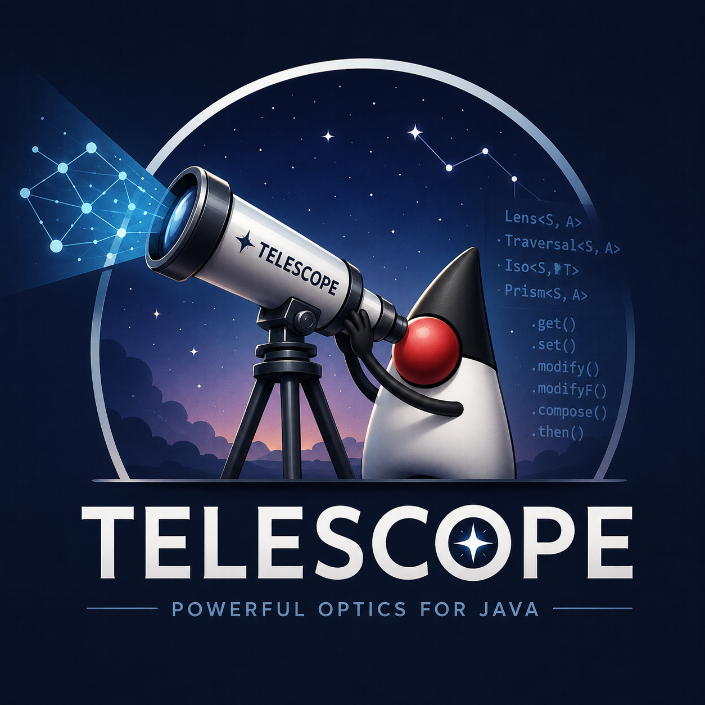
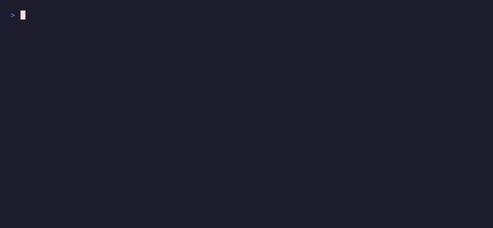

<p align="center">
  
</p>

# telescope

[](https://openjdk.org/projects/jdk/21/)
[](https://github.com/eschizoid/telescope/actions/workflows/ci.yaml)
[](https://codecov.io/gh/eschizoid/telescope)
[](https://central.sonatype.com/artifact/io.github.eschizoid/telescope-core)
[](https://javadoc.io/doc/io.github.eschizoid/telescope-core)
[](https://opensource.org/licenses/Apache-2.0)

Telescope is built around a reusable typed path. A path is a value, built from method references and checked by `javac`,
that points at data anywhere inside a nested structure.

```java
static final Telescope<Company, String> EMAILS = Telescope.of(Company.class)
  .each(Company::departments)
  .each(Department::teams)
  .each(Team::users)
  .field(User::email);
```

With a path in hand, you can read through it and collect or count every value it reaches. You can also rebuild the whole
tree through it without mutating anything, as in `EMAILS.update(company, String::toLowerCase)`. Mapping between two
types uses the same idea, with each row pairing a source path to a target path.

```java
Mapper<Order, OrderDto> mapper = Telescope.mapper(
  Order.class,
  OrderDto.class,
  to(Order::customerName, OrderDto::fullName)
);

OrderDto dto = mapper.forward(order); // same-name fields map automatically, and nesting recurses
mapper.explain();                     // the report is built from the mapper you are holding
```

The mapper is a value. You can hold it, reuse it across call sites, and ask it what it maps while the program runs. You
can also compose it into a longer path with `mapper.asTelescope().then(...)`. [MapStruct](https://mapstruct.org/) turns
a mapping into a generated class at compile time instead. The sections below explain where telescope differs for someone
who uses MapStruct today.

<p align="center">
  
  <br />
  <sub>The <a href="examples/mapstruct-vs-telescope/"><code>mapstruct-vs-telescope</code></a> test printing its own
  output, trimmed for width.</sub>
</p>

## Field names are checked by the compiler

Every field a telescope mapping row names is a method reference. `javac` checks it, and your IDE's ordinary rename moves
it. MapStruct names fields with strings inside `@Mapping` annotations. Its processor validates those strings at compile
time. The [MapStruct IDEA plugin](https://mapstruct.org/documentation/ide-support/) refactors them according to its
documentation, but a plain rename in the editor doesn't touch them.

```java
// MapStruct
@Mapping(source = "customerName", target = "fullName")
OrderDto toDto(Order order);

// telescope
Telescope.mapper(Order.class, OrderDto.class, to(Order::customerName, OrderDto::fullName));
```

The two tools fail differently when a name goes stale. Renaming a source property that an explicit
`@Mapping(source = ...)` names fails the MapStruct build with an error. Without the plugin, you then fix the string by
hand in every mapper. Renaming or adding a target property with no source counterpart is different. Under MapStruct's
default `unmappedTargetPolicy = WARN` it only produces a warning, and the field is `null` at run time.
`ReportingPolicy.ERROR` turns that warning into a build failure with one line. `Telescope.mapper(...)` refuses unmapped
fields when the mapper is built, so telescope differs here only in its default.

Nested targets stay typed too. MapStruct writes `@Mapping(source = "flat", target = "a.b.c")` with a dotted string.
Telescope accepts a navigator as the target of a row. The `@Focus` annotation processor generates such a navigator for a
record, and each of its steps is a method call that `javac` checks.

```java
Telescope.mapper(Cart.class, CartDto.class,
  to(Cart::customerName, CartDtoTelescope.of().shipping().recipient().fullName()));
```

`@Bridge` is an annotation that has the `telescope-codegen` processor generate a mapper at compile time, and it does
name fields with strings. Its entries, e.g. `@Rename` and `@Compute`, take field names as strings. The processor reports
a name that isn't a field of the class as a compile error. `@FromMap(required = ...)` also takes strings, which name map
keys.

The [head-to-head module](examples/mapstruct-vs-telescope/) tests MapStruct's default-policy unmapped-target case. The
rename failures can't be passing tests, because a rename has to be applied by hand to show them. The module documents
them as manual steps instead, and the IDE plugin's behavior is cited from its documentation.

## Runtime and generated mappers give the same result on container shapes

Telescope can run the same mapping in two ways. A runtime mapper, built by `Telescope.mapper(...)`, does the conversion
while the program runs, with no annotations and no build step. Putting `@Bridge(Target.class)` on the source type makes
the `telescope-codegen` annotation processor generate the same conversion as plain Java, which is a generated mapper.
You can start with a runtime mapper and move a mapping to `@Bridge` later, when that code needs the speed.

```java
@Bridge(InvoiceDto.class)
public record Invoice(Long id, String customer, long totalCents) {}

public record InvoiceDto(Long id, String customer, long totalCents) {}

// at run time, with or without the annotation
InvoiceDto viaMapper = Telescope.mapper(Invoice.class, InvoiceDto.class).forward(invoice);

// generated at compile time
InvoiceDto viaBridge = InvoiceBridge.BRIDGE_FN.forward(invoice);
```

A test holds the two kinds of mapper to the same result on container shapes and on how a target is constructed.
`CrossPathCorpusTest` crosses container families with element shapes and runs one input through each kind for every
cell. It fails when the two disagree. It runs as part of `./gradlew check`, which is what CI runs. Its container grid
has no recorded disagreements. Renames, null strategies, and defaults aren't cross-checked by it.

Two known differences are recorded in tests, each with its direction. In `CrossPathCorpusTest`, a target reachable only
through a private constructor is built at run time. The processor refuses it when `@Bridge`'s `writeStrategy` asks for
setters or for a constructor. In `ContainerAllocatorCorpusTest`, `@Bridge` accepts a `Map` field mapped onto an
`EnumMap` field, and `Telescope.mapper(...)` refuses it. A runtime mapper only converts an `EnumMap` target whose source
is the same `EnumMap` type. Each test also fails the build when a recorded difference goes away, so the list stays
accurate.

## Unconvertible fields are refused

`Telescope.mapper(...)` and a `@Bridge` refuse a field they can't map or convert. The refusal comes when the mapper is
built or when the code compiles. The message names the field, the types involved, and the fix. A record `Tgt` with a
field `b` that `Src` doesn't have gets this message from `Telescope.mapper(Src.class, Tgt.class)`.

```text
Deep map Src → Tgt: target field 'b' has no same-name source field. Add a rename row to(sourceAccessor, targetAccessor) that maps to 'b'.
```

You can see the refusal before run time. With `telescope-codegen` on the annotation processor path, a mapper verifier
reports the same message as a compile error. It checks each `Telescope.mapper(...)` call whose types it can read.
`-Atelescope.verify=warn` turns it into a warning, and `=off` turns it off.

Some entry points are lenient on purpose. `mapperForward(...)` and `@Bridge(lenient = true)` leave an unmatched target
field at its default value, which is `null`, zero, or `false`. `Telescope.fromMap(...)` fills a component with no value
from a default for its type. `Mapper.into(...)` writes onto an existing bean and skips a property with no public setter.

Same-typed JDK collections are copied rather than shared, so changing the target's list never changes the source's.
[Mapping](#mapping) has the details.

## Measured performance

In the latest run, telescope's generated mappers took between about the same time as MapStruct and 1.37 times its time,
depending on tier, direction and call shape. They allocated the same bytes per call as MapStruct on every row. The one
exception is in MapStruct's own Set forward row, where one of its four forks allocated 32 bytes less than the other
three.

<!-- metrics: from MapStructComparisonBenchmark, Actions run 37761344960; the Map row spans five runs -->

| Tier, `BRIDGE.read` against MapStruct | forward time                  | backward time                 | bytes per call, telescope |
| ------------------------------------- | ----------------------------- | ----------------------------- | ------------------------- |
| flat, 5 scalars                       | 1.07 times                    | 1.04 times                    | 32                        |
| nested, one nested type               | 1.29 times                    | 1.02 times                    | 48                        |
| deep, 3 levels and list hops          | 1.10 times                    | 1.00 to 1.10 times            | 376                       |
| Map field, 100 entries                | 1.02 to 1.14 times, five runs | 0.95 to 1.10 times, five runs | 7,528, same as MapStruct  |
| Set field, 100 entries                | 0.93 to 1.01 times            | 1.02 times                    | 7,576 forward, 7,544 back |

The table times the composable `BRIDGE.read` value. The `BRIDGE_FN` constant and the static `forward` method measured
1.00 times MapStruct forward on flat, 1.37 times on nested, and 1.06 on deep for static `forward` and 1.10 for
`BRIDGE_FN`. The table comes from GitHub Actions run 37761344960 on `main` at `f7be3f30`, using the included JMH
workloads with MapStruct 1.6.3 on JDK 25. The run used 4 forks of 8 measured iterations each. MapStruct's own rows are
the control, so each ratio is read within this one run. Where the error bands of the two rows overlap, the table gives a
range instead of one ratio. The Map row is the exception. It gives the spread of the per-run ratios across five runs,
which are listed in the methodology document. The
[methodology, per-fork figures, and earlier runs](docs/perf-mapstruct-comparison.md) are recorded separately.

Runtime mappers are slower than generated ones, and the gap shrinks as the work per call grows. Without codegen,
`Telescope.mapper(...)` composes each record or bean pair into a single `MethodHandle`. On the same run it measured 3.34
times MapStruct forward on flat, 2.68 on nested, and 1.27 on deep. On the 100-entry fields it measured 1.03 times on
Set, and between 1.05 and 1.12 times on Map across the same five runs. It allocated the same bytes as MapStruct on every
tier except the Map field, where it allocated 32 bytes more. A fixed cost of about 7 ns per call is nearly the whole gap
on flat and nested shapes. Deep and container shapes add a cost per converted element, so their absolute gap grows while
the ratio falls.

Flat, nested, and deep conversions take well under a microsecond with both kinds of mapper. The 100-entry container rows
take more than one with both. Read the tier that matches your shape. You can reproduce any of it from the
[`Benchmarks`](.github/workflows/benchmarks.yaml) GitHub Action. The full matrix is in
[`benchmarks/README.md`](benchmarks/README.md#mapstruct-comparison-apples-to-apples).

---

## How it compares to MapStruct

MapStruct is a compile-time bean mapper with a mature ecosystem and broad adoption. It converts whole objects, including
nested graphs. It has dotted paths, automatic sub-mapping methods, collections, and builders, for example. Every
comparison here pins MapStruct 1.6.3, which is the version the head-to-head module and the benchmarks build against.

Telescope overlaps MapStruct on mapping and adds reusable typed paths. MapStruct has no way to point at
`company.departments[].address.city` as a value you can hold and read. Telescope can also update through such a value
without mutation, or run the update inside an async or validation result.

The runnable head-to-head module writes the same `Order` to `OrderDto` mapping both ways, in
[`examples/mapstruct-vs-telescope`](examples/mapstruct-vs-telescope/).

```bash
./gradlew :examples:mapstruct-vs-telescope:test
```

Its tests show both libraries producing the same `OrderDto`. They also cover MapStruct's default-policy unmapped-target
case and a deep immutable update. MapStruct's `@MappingTarget` updates mutate an existing instance in place, so a deep
immutable update sits outside its mapping model.

### Capability comparison

The rows below are differences in design rather than things MapStruct can't do. A mapping held as a value can be
composed, reversed, and asked about while the program runs. A mapping compiled into a generated class is complete at
build time, by design.

| Capability                        | telescope                                                          | MapStruct                                                            |
| --------------------------------- | ------------------------------------------------------------------ | -------------------------------------------------------------------- |
| Bidirectional mapping             | one row list, with `forward(...)` and `backward(...)` on one value | a second method plus `@InheritInverseConfiguration`, with exclusions |
| Deep nested navigation and update | `of(C).each(C::depts).field(D::address).update(c, fn)`             | not in scope, and `@MappingTarget` mutates in place                  |
| Update inside a result type       | `updateAsync`, `updateOptional`, `updateEither`, `updateValidated` | not in scope, so pair it with other code                             |
| Accumulating validation           | `Validated.combine(...)` collects every failure in one pass        | not in scope, so pair it with Bean Validation or write it            |
| Reading an untyped map            | `Telescope.fromMap(T.class, extract(...))` and `@FromMap`          | supported, with the per-key conversion as a separate mapping method  |
| Mapper introspection              | `explain()`, `trace(input)`, or a log level                        | read the generated source, which you can step through                |
| Unmapped-target safety            | strict at construction by default                                  | `WARN` by default, with `ERROR` a one-line opt-in                    |
| Sealed-root dispatch              | `Match.of(...).when(...).exhaustive()`, checked over the permits   | `@SubclassMapping`, broader hierarchies, no sealed check             |
| Multi-source merge, many to one   | `Telescope.merge(Target.class, from(...), ...)`                    | first-class multi-source methods, disambiguated by string            |
| No codegen required               | `Telescope.of(Class)`, with `@Focus` as a later opt-in             | compile-time only                                                    |
| GraalVM native-image              | codegen needs no config, and runtime mappers work there too        | fully AOT-compatible for codegen, with no runtime mapper to need it  |

The [coverage matrix](docs/mapstruct-parity.md) scores 29 MapStruct features against telescope. It rates 13 as covered
fully and 16 as covered partially. Each partial row states its limitation, and every verdict cites the source and tests
behind it. The [migration guide](docs/mapstruct-migration.md) turns the matrix into steps you apply one mapper at a
time.

### When MapStruct is the right pick

- You need mapping bodies written in an embedded expression language, such as `@Mapping(expression = "java(...)")` or
  qualifier dispatch. Telescope takes plain Java mappers passed to `Mapping.via(...)` instead.
- You need `@SubclassMapping` across hierarchies that are open rather than sealed. Telescope's `Match` covers sealed
  roots, and the [coverage matrix](docs/mapstruct-parity.md) scores the gap.
- Conversion is the whole job, with no path reuse or deep updates. Your team also treats readable generated mapper
  source as a feature.

### When telescope is the right pick

- Your problem includes deep navigation and updates alongside mapping, on records, POJOs, or a mix.
- You want field names checked by `javac`, and unmapped fields refused by default.
- You need to run an update inside an async or validation result, merge several sources, or handle every subtype of a
  sealed root.
- You read untyped `Map<String, Object>` payloads, or you deploy to GraalVM native-image and want mapping with no build
  step.

To try it, write your next mapper as one `Telescope.mapper(...)` call and leave every existing MapStruct mapper alone.
The [migration guide](docs/mapstruct-migration.md) covers running both side by side.

---

## Install

```kotlin
// Gradle (Kotlin DSL)
dependencies {
  implementation("io.github.eschizoid:telescope-core:1.9.0")
}
```

```xml
<!-- Maven -->
<dependency>
  <groupId>io.github.eschizoid</groupId>
  <artifactId>telescope-core</artifactId>
  <version>1.9.0</version>
</dependency>
```

The snippet above is the runtime. Compile-time codegen, the Spring Boot starter, the Quarkus extension, and JPMS setup
are [listed below](#published-artifacts).

---

## Quick start

You can update a field deep inside nested data without writing copy constructors. The example below is complete, so you
can paste it into a `main` and run it.

```java
import io.github.eschizoid.telescope.Telescope;

record Address(String city, String zip) {}

record User(String name, Address address) {}

// 1. Build a typed path once. Telescope values are immutable and thread-safe, so static final suits them.
final var userCity = Telescope.of(User.class).field(User::address).field(Address::city);

// 2. Use the path for reading, updating, and everything else.
final var alice = new User("Alice", new Address("Springfield", "49007"));

String city = userCity.read(alice); // "Springfield"

User shouted = userCity.update(alice, String::toUpperCase); // city becomes "SPRINGFIELD", and alice is untouched
```

Everything else in the library starts from a path like `userCity`. Mapping between types and navigating containers both
use one. Running an update inside an async or validation result does too.

The guides go deeper on each part.

- [docs/navigation.md](docs/navigation.md) covers `List<X>`, `Optional<X>`, `Map<K, V>`, and the whole DSL surface.
- [docs/type-conversion.md](docs/type-conversion.md) covers conversion from record to record and from POJO to record.
- [docs/introspection.md](docs/introspection.md) covers `explain()`, `trace()`, and logging through a log level.
- [docs/effects.md](docs/effects.md) covers updates inside async, validated, either, and optional results.

---

## Choosing an entry point

Your choice depends on what you work with and what you want to do. Records and POJOs have separate entry points.
Navigating one type in place is separate from converting between two types.

| You want to                        | Records                                          | POJOs                                   | POJO and record together                        |
| ---------------------------------- | ------------------------------------------------ | --------------------------------------- | ----------------------------------------------- |
| **Navigate and update** in place   | `Telescope.of(R.class)`                          | `Telescope.ofBean(P.class)`             | convert first (below), then navigate the record |
| **Convert or map** between types   | `Telescope.mapper(A.class, B.class, to(...), …)` | `Telescope.mapper(A.class, B.class, …)` | `Telescope.mapper(P.class, R.class, …)`         |
| **Read an untyped map**            | `Telescope.fromMap(R.class, extract(...))`       | `Telescope.fromMap(P.class, …)`         | `@FromMap` for a generated binder               |
| **Bind at compile time** (codegen) | `@Focus` to navigate                             | `@BeanFocus` to navigate                | `@Bridge` to convert any pair                   |

The runtime entry points in the first three rows need no annotations and no build step. The last row lists the
annotations that the `telescope-codegen` processor reads. `@Focus` and `@BeanFocus` generate a navigator whose steps are
method calls. `@Bridge` generates a conversion as plain Java for a known pair. The codegen guide is
[docs/codegen.md](docs/codegen.md).

`Telescope.mapper(...)` returns a `Mapper`, which has `forward`, `backward`, and `patch`. `patch(base, partial)` returns
a copy of `base` with the partial's non-null reference fields, and all of its primitive fields, written over it.
`Telescope.map(...)` takes the same rows and returns a `Telescope` path instead. A conversion that runs in both
directions composes into a longer path with `.then(...)`.

Rows handle the cases that same-name matching can't. A field with a different name gets a
`Mapping.to(srcAccessor, tgtAccessor)` row. A class whose write strategy isn't detected gets a
`WriteHint.writeBean(target, strategy)` row. [docs/pojos.md](docs/pojos.md) covers both.

The rest of this README uses these terms.

- A **typed path** is a `Telescope<S, A>` value built from method references, such as `EMAILS` at the top of this page.
- A **runtime mapper** is a mapper built while the program runs, by `Telescope.mapper`, `Telescope.mapperForward`,
  `Telescope.merge`, or `Telescope.fromMap`, with no annotations and no build step.
- A **generated mapper** is the conversion the `telescope-codegen` processor writes at compile time for `@Bridge` or
  `@FromMap`.

For a sealed root, `Match.of(...)` dispatches over the permitted subtypes. `.exhaustive()` reads the permits and throws
when a subtype has no handler. The check happens when you call `.exhaustive()`, not at compile time.

---

## Records, mapping, beans, and untyped maps

The sections below show a deep update on records, a mapping to DTOs, an update on POJOs, and binding a
`Map<String, Object>`.

### Records

The examples in this section and the next use these records.

```java
import io.github.eschizoid.telescope.Telescope;

record Address(String city, String zip) {}

record User(String name, int age, String email, Address address) {}

record Team(String name, List<User> users) {}

record Department(String name, List<Team> teams) {}

record Company(String name, List<Department> departments) {}
```

Here is one task, lowercasing every user's email in a whole company tree, done both ways.

#### Without telescope

```java
final Company lowered = new Company(
  company.name(),
  company
    .departments()
    .stream()
    .map((d) ->
      new Department(
        d.name(),
        d
          .teams()
          .stream()
          .map((t) ->
            new Team(
              t.name(),
              t
                .users()
                .stream()
                .map((u) -> new User(u.name(), u.age(), u.email().toLowerCase(), u.address()))
                .toList()
            )
          )
          .toList()
      )
    )
    .toList()
);
```

#### With telescope

With telescope, the task is one call on the `EMAILS` path from the top of this page.

```java
final Company lowered = EMAILS.update(company, String::toLowerCase);
```

The first version is about 25 lines of manual reconstruction. Every constructor is spelled out, and every untouched
field is passed through by hand. The second version reuses a path, and the same path also reads.

```java
EMAILS.toList(company);   // List<String> of every email
EMAILS.count(company);    // how many there are
```

To log or record metrics at a point in the path, attach an observer after that step.

```java
final Telescope<Company, String> observedEmails = Telescope.of(Company.class)
  .each(Company::departments)
  .observe((dept) -> log.info("department: {}", dept.name()))
  .each(Department::teams)
  .observe((team) -> log.info("team: {}", team.name()))
  .each(Team::users)
  .observe((user) -> log.info("user: {}", user.email()))
  .field(User::email);

final Company result = observedEmails.update(company, String::toLowerCase);
```

An observer runs synchronously when a terminal operation executes, once for each value reached at that step. Reads
report the current values from the outside in. Updates report rebuilt values from the inside out. Failed input futures,
`Either.Left`, `Optional.empty`, and `Validated.Invalid` skip observation. A later reconstruction failure can't undo
observations that were already emitted.

For example, you can count the users a read visits with an injected
[Micrometer `MeterRegistry`](https://docs.micrometer.io/micrometer/reference/concepts/counters.html).

```java
final var usersVisited = meterRegistry.counter("telescope.users.visited");

final Telescope<Company, String> meteredEmails = Telescope.of(Company.class)
  .each(Company::departments)
  .each(Department::teams)
  .each(Team::users)
  .observe((user) -> usersVisited.increment())
  .field(User::email);

final List<String> values = meteredEmails.toList(company);
```

`Telescope.all` folds several edits on one structure into a single reusable normalizer, with one `over(...)` row per
path.

```java
final Telescope<Company, Company> normalize = Telescope.all(
  over(EMAILS, String::toLowerCase),
  over(Telescope.of(Company.class).field(Company::name), String::strip)
);

final Company cleaned = normalize.apply(company);
```

The two edits above touch different fields of the same root, so the fold rebuilds that root once instead of twice. Edits
that share a longer prefix save more, because their shared steps are walked once. Edits run one after another on a path
that doesn't record its steps, such as a path built by `then(...)`, by `Telescope.lens(...)`, or by a generated
navigator.

### Mapping

A mapping applies paths across two shapes. Below, the `Company` tree from [Records](#records) is translated to a
partner-facing `CompanyDto` with a few renamed fields.

```java
record AddressDto(String town, String postalCode) {}

record UserDto(String fullName, int age, String email, AddressDto address) {}

record TeamDto(String name, List<UserDto> users) {}

record DepartmentDto(String name, List<TeamDto> teams) {}

record CompanyDto(String name, List<DepartmentDto> departments) {}

final Mapper<Company, CompanyDto> dtoMapper = Telescope.mapper(
  Company.class,
  CompanyDto.class,
  to(User::name, UserDto::fullName), // a rename, applied everywhere User and UserDto recurse
  to(Address::city, AddressDto::town),
  to(Address::zip, AddressDto::postalCode)
);

final CompanyDto dto = dtoMapper.forward(company);

final Company restored = dtoMapper.backward(dto); // the same row list, run in reverse
```

You only name what changes. Same-name fields map automatically, including nested ones. `User::email`, `User::age`, and
all the list and tree wiring need no rows.

The same row list also runs backward for the rows that can be reversed. In MapStruct, the reverse direction is a second
method on the same interface. `@InheritInverseConfiguration` copies eligible configuration from the forward method, but
its javadoc excludes expressions, constants, and default values. Telescope has the same kind of limit, because
`constant`, `compute`, and one-way rows are forward-only.

Constants and computed values go in the same call. They match MapStruct's `@Mapping(constant = "...")` and
`@Mapping(expression = "java(...)")`.

```java
Telescope.mapper(Order.class, OrderDto.class,
  to(Order::id, OrderDto::id),
  constant(OrderDto::tenant, "production"),   // an eager literal
  compute(OrderDto::createdAt, Instant::now), // fresh on every call
  compute(OrderDto::traceId, UUID::randomUUID),
  compute(OrderDto::metadata, HashMap::new)); // a fresh container on every call
```

`constant` captures its value once when the row is built. `compute` calls the supplier on each forward call. Use
`compute` whenever a literal would share one mutable reference, as `HashMap::new` would. On the backward direction,
neither row writes the source field. A reference field comes back `null`, and a primitive comes back as zero or `false`.

Every mapper built this way can report what it does, with no generated source to read. `explain()` describes the top
level of the pair.

```java
dtoMapper.explain();
// Mapped:
//   ✓ name                                       → name
//
// Transformations:
//   • departments(java.util.List<Department>) → java.util.List<DepartmentDto>
```

The rendered text is a view of data you can assert on. For a strict bidirectional mapper,
`explain().skipped().isEmpty() && explain().unusedSources().isEmpty()` means every field on both sides is accounted for.
Constant and computed slots are filled rather than skipped, so they don't appear as rows. `trace(input)` reports real
values, and a log level can narrate every conversion. [docs/introspection.md](docs/introspection.md) covers both.

#### Same-typed containers

A field whose declared type is the same on both sides is handed across as the same instance, with some exceptions. A
`List`, `Set`, `Map`, or other JDK collection gets a shallow copy instead. The copy happens forward, backward, and in
`patch`. Changing the target's container then never changes the source's. Arrays aren't copied, so the target holds the
source's array. A field declared as your own collection class, such as `class Urls extends ArrayList<String>`, is handed
across as it is too.

The copy keeps the source's order, including a sorted set's comparator. It never creates an instance of a class
telescope doesn't know, such as a framework's own collection.

- The common JDK classes, such as `ArrayList`, `HashSet`, `TreeMap`, and `EnumMap`, are copied into their own class.
- A sorted set, sorted map, or priority queue of another class is copied into `TreeSet`, `TreeMap`, or `PriorityQueue`.
- Anything else is copied into the default class for the declared type. `Arrays.asList(...)` and
  `Collections.synchronizedList(...)` become an `ArrayList`, and a `LinkedBlockingQueue` declared as `Queue` becomes an
  `ArrayDeque`.
- The JDK's unmodifiable containers, from the `List.of` family and the `Collections` views, are handed across as they
  are. Other immutable collections, such as Guava's, are copied.

`Telescope.mapper(...)` and a `@Bridge` make the same copy. A collection backed by a lazy JPA collection, such as
Hibernate's `PersistentSet` or `PersistentBag`, is iterated while it's copied. Iterating is expected to load it inside a
session and to throw `LazyInitializationException` outside one. To keep a container shared, give the field a row with
its own functions.

```java
Telescope.mapper(Src.class, Tgt.class, to(Src::items, Tgt::items, x -> x, x -> x));
```

### Beans

POJOs don't need a mirror record. You navigate the bean directly with `ofBean`, and `set` and `update` build a new root.
The update rebuilds the modified path and never mutates the original. Untouched mutable subtrees are shared between the
old and new roots rather than cloned ([details](docs/pojos.md)).

```java
class Address {
  /* getCity()/setCity(), getZip()/setZip() */
}

class User {
  /* getName(), getAddress() + setters */
}

final User moved = Telescope.ofBean(User.class)
  .field(User::getAddress)
  .field(Address::getCity)
  .update(user, String::toUpperCase); // a new User, and `user` is untouched
```

If you'd rather work with records, convert a POJO with `Telescope.mapper(Pojo.class, Record.class, ...)` and navigate
the record instead. [docs/pojos.md](docs/pojos.md) covers that workflow.

### Reading an untyped map

`Telescope.fromMap` binds a `Map<String, Object>` to a record or POJO, with one `extract(...)` row per component you
want filled. Data from a JSON body, a JDBC row, or a message header often arrives in that shape.

```java
final ForwardMapper<Map<String, Object>, CaseListRequest> requests = Telescope.fromMap(
  CaseListRequest.class,
  extract("bookingType", CaseListRequest::getBookingType, Object::toString),
  extract("caseId", CaseListRequest::getCaseId, Object::toString),
  extract("priority", CaseListRequest::getPriority, (v) -> Integer.parseInt(v.toString()))
);

final CaseListRequest request = requests.forward(payload);
```

A component with no value takes a default for its declared type. The value is missing when its key is absent, when the
key holds `null`, or when no row names it. The default is `null` for a reference and zero or `false` for a primitive. A
component declared exactly `List`, `Set`, `Map` or `Optional` gets an empty one. The binder generated by `@FromMap`
produces the same values for the same record. A converter is called only for a value that's present. The `fromMap`
defaults differ from those of `mapperForward`, which leaves an unpaired container `null`.

Write `required(...)` in place of `extract(...)` where a key has to carry a value. A map with no value under that key is
refused with an `IllegalArgumentException` before any converter runs. The message names every missing required key
beside the component it was to fill. On a `@FromMap` type, `@FromMap(required = {"id"})` makes the generated binder
refuse the same maps with the same message. `explain()` reports each row as `default when absent` or `required`.

Some rows and components are refused while the mapper is built.

- A row that names a bean property with no setter, builder method, or constructor parameter is refused. The value it
  reads would be dropped.
- A component that no row names is refused when its type has no default of its own. Examples are an array, a concrete
  container like `ArrayList`, a `Collection`, or a class with no generated binder. The message names the component, its
  type, and the fix.
- A row that names such a component converts it, and an absent key leaves it `null`.

A generated `@FromMap` binder has to be registered before `fromMap` uses it. On the class path the processor registers
it for you. On the module path and in a fat jar you have to add a line or merge service files.
[docs/codegen.md](docs/codegen.md#registering-frommap-binders) has the details.

There's no backward direction. A flat `String`-keyed map is a boundary format rather than a typed counterpart. A round
trip would have to invent a key-encoding policy, and telescope doesn't pick one for you. Annotating the target with
`@FromMap` generates a binder at compile time that uses no reflection. It keys strictly by field name with no per-row
converter.

MapStruct maps from a map too. Its processor reads the keys as properties. A method declared as
`Target fromMap(Map<String, Object> src)` generates the same shape of binder, once you declare the conversion methods it
asks for. The difference is where a per-key conversion goes. Telescope takes it inline as the third argument to
`extract(...)`. MapStruct takes it as a separate mapping method on the interface.

---

## Integrations

### Spring Boot starter

`telescope-spring-boot-starter` registers every `Mapper<A, B>` bean in a `TelescopeMapperRegistry`, indexed by source
and target class. It also generates Spring components for `@TelescopeMapper` and `@TelescopeTransformer`, which are
annotations from `telescope-core`. With them, the starter can normalize entity values before mapping them to a REST DTO.
Declare transformers on the projection, and Spring injects and applies them in order.

```java
record CustomerRestDto(String email) {}

record CustomerEntity(String email) {}

@TelescopeTransformer
interface CustomerEmailTransformer extends TelescopeTransformation<CustomerEntity, String> {
  default Telescope<CustomerEntity, String> path() {
    return Telescope.of(CustomerEntity.class).field(CustomerEntity::email);
  }

  default Transformation<String> transform() {
    return new Transformation<>("unknown@example.com", (email) -> email.strip().toLowerCase(Locale.ROOT));
  }
}

@TelescopeMapper(transformers = CustomerEmailTransformer.class)
interface CustomerProjection extends TelescopeProjection<CustomerEntity, CustomerRestDto> {}

@Service
class CustomerService {

  private final CustomerProjection projection;

  CustomerService(CustomerProjection projection) {
    this.projection = projection;
  }

  CustomerRestDto register(CustomerEntity customer) {
    return projection.map(customer);
  }
}
```

`map` applies the transformer before structural mapping. A null email gets the declared default. A non-null email is
trimmed and lowercased. The original entity is unchanged. For fields with different names, add typed translation rows.

```java
record AccountEntity(String displayName, String phoneNumber) {}

record AccountRestDto(String name, String phone) {}

@TelescopeMapper("accountMapper")
interface AccountMapper extends TelescopeProjection<AccountEntity, AccountRestDto> {
  default void translate(MapperBuilder<AccountEntity, AccountRestDto> mapping) {
    mapping
      .from(AccountEntity::displayName)
      .to(AccountRestDto::name)
      .from(AccountEntity::phoneNumber)
      .to(AccountRestDto::phone);
  }
}
```

The generated Spring bean also has `forward`, `backward`, and `patch`. Transformers run only on the way forward. To
register transformers from configuration, declare a typed `TelescopeCustomizer<AccountMapper>` bean, with no bean names
involved. The [Spring starter guide](spring-boot-starter/README.md) covers both forms and their Spring wiring.

### Quarkus

`telescope-quarkus` is a Quarkus CDI extension with the same registry shape. A `Mapper<A, B>` from a `@Produces` method
or an `@ApplicationScoped` class shows up in `TelescopeMapperRegistry` under its source and target class. The generated
`@TelescopeMapper` beans are Spring-only for now. The [Quarkus guide](quarkus/README.md) has the setup.

### Lombok

`telescope-lombok` is a Lombok-aware variant of the annotation processor. It finds `@Data`, `@Value`, and `@Builder`
POJOs on its own. For each one it emits the same typed navigator that `@Focus` gives a record. It has to come after
Lombok in the processor list, which the [Lombok guide](lombok/README.md) and [docs/codegen.md](docs/codegen.md) explain.

### Native image

Runtime mappers and typed paths work inside a GraalVM native image, so `Telescope.mapper(...)` and `.field(User::name)`
run there with no build step. Generated code from MapStruct and from telescope is free of reflection. Both build under
native-image with no configuration.

Inside an image, telescope swaps its `LambdaMetafactory` accessors for plain `MethodHandle` closures.
`LambdaMetafactory` defines classes at run time, and native-image forbids that. One `static final boolean` picks the
branch. `telescope-core` carries its own native-image metadata. You register your own DTO types the way you would in any
GraalVM application.

CI checks native-image support in two ways. The `:core:imageTest` and `:internal:imageTest` tasks re-run each module's
whole suite with the `imagecode` property set. Every existing assertion then runs on the code an image uses, and both
tasks are part of `check`. A verifier covering nine capabilities also compiles and runs as a native binary. It runs on
every push to `main` that touches the substrate, and weekly. Setup and limits are in
[`docs/native-image.md`](docs/native-image.md).

---

## Examples

The runnable modules below cover the surface, so pick the one that matches what you're evaluating.

| Module                                                                         | Stack                         | Pick when                                                                                                   |
| ------------------------------------------------------------------------------ | ----------------------------- | ----------------------------------------------------------------------------------------------------------- |
| [`examples/library/`](examples/library/)                                       | plain Java, no framework      | You want to see what the DSL does on its own, in a set of small capability demos, each with its own `main`  |
| [`examples/springboot/order-jpa/`](examples/springboot/order-jpa/)             | Spring Boot + JPA + Hibernate | You want everything at once, across several controllers over one realistic `Order` domain on a single stack |
| [`examples/springboot/product-starter/`](examples/springboot/product-starter/) | Spring Boot autoconfig        | You want registry discovery with no wiring, where you declare `@Bean Mapper<A, B>` and the starter finds it |
| [`examples/springboot/org-chart/`](examples/springboot/org-chart/)             | Spring Boot + JPA cycles      | You have a domain that refers to itself, such as an org chart or a thread, and want cycle-safe mapping      |
| [`examples/springboot/invoicing/`](examples/springboot/invoicing/)             | `@Bridge` codegen             | You want conversion bound at compile time on a hot path                                                     |

Start with [`order-jpa/`](examples/springboot/order-jpa/) for the broadest view. Start with
[`examples/library/`](examples/library/) to see telescope without a framework around it. The per-module guide is
[`examples/springboot/README.md`](examples/springboot/README.md).

---

## Published artifacts

Everything is published to Maven Central under `io.github.eschizoid`.

| Artifact                        | Role                                                                                                                                                                                                                                                              |
| ------------------------------- | ----------------------------------------------------------------------------------------------------------------------------------------------------------------------------------------------------------------------------------------------------------------- |
| `telescope-core`                | The DSL, meaning `Telescope`, `Mapper`, `Mapping`, `Either`, `Validated`, and the annotations. Add this one for typed paths and runtime mappers.                                                                                                                  |
| `telescope-internal`            | The optic lattice and reflection helpers. Transitive only, so it arrives automatically. A consumer that is itself a JPMS module can't compile against it, because the exports are qualified to `:core`. A classpath consumer can reach it and shouldn't.          |
| `telescope-codegen`             | The optional annotation processor for `@Focus`, `@BeanFocus`, `@Bridge`, and `@FromMap`, described in [docs/codegen.md](docs/codegen.md). It also registers the mapper verifier, which runs on every compilation and is turned off with `-Atelescope.verify=off`. |
| `telescope-lombok`              | A Lombok-aware variant of the processor, for `@Data`, `@Value`, and `@Builder` POJOs.                                                                                                                                                                             |
| `telescope-spring-boot-starter` | Spring Boot autoconfiguration plus a `Mapper<A, B>` bean registry. Compiled and CI-tested against Spring Boot 4.1.1.                                                                                                                                              |
| `telescope-quarkus`             | A Quarkus CDI extension with the same registry shape. Compiled and CI-tested against Quarkus 3.40.1.                                                                                                                                                              |

Installation snippets, annotation-processor ordering with Lombok, and JPMS setup are in
[docs/codegen.md](docs/codegen.md). On the module path, typed paths and runtime mappers work on an application module's
types once that module opens their package to `io.github.eschizoid.telescope.internal`. An unqualified `opens` works
too. Telescope adds the read edge to the application module itself.

---

## Documentation

| Doc                                                                    | What is in it                                                                                       |
| ---------------------------------------------------------------------- | --------------------------------------------------------------------------------------------------- |
| [docs/navigation.md](docs/navigation.md)                               | The whole DSL surface, a cookbook for containers, sealed cases, filters, and multi-edit, plus nulls |
| [docs/type-conversion.md](docs/type-conversion.md)                     | Explicit conversions with `from/to/using`, and automatic structural mapping with `Telescope.map`    |
| [docs/pojos.md](docs/pojos.md)                                         | Bean navigation, write strategies, aliasing, and the workflow between POJOs and records             |
| [docs/effects.md](docs/effects.md)                                     | The four effects, exception semantics, and what the async executor does and does not bound          |
| [docs/introspection.md](docs/introspection.md)                         | `explain()`, `trace()`, and auto-logging, plus exactly what the report contains                     |
| [docs/codegen.md](docs/codegen.md)                                     | `@Focus`, `@BeanFocus`, `@Bridge`, `@FromMap`, Lombok ordering, and JPMS setup                      |
| [docs/native-image.md](docs/native-image.md)                           | The GraalVM contract, meaning what telescope ships and what your application registers              |
| [docs/mapstruct-parity.md](docs/mapstruct-parity.md)                   | The 29-feature coverage matrix, with evidence per row                                               |
| [docs/mapstruct-migration.md](docs/mapstruct-migration.md)             | Migration one mapper at a time, a coexistence setup, and a translation table                        |
| [docs/perf-mapstruct-comparison.md](docs/perf-mapstruct-comparison.md) | Benchmark methodology, the environment, and the full result set                                     |

---

## Constraints

Telescope works on records and JavaBeans-style POJOs. Records rebuild through the canonical constructor. POJOs rebuild
through a write strategy telescope detects. It tries a builder, then an all-args constructor, then setters. You can
override the choice per class with `WriteHint.writeBean(...)`.

Paths take method references, not lambdas. `.field(User::name)` works. `.field(u -> u.name())` is rejected when the path
is built, with an error saying so. Telescope recovers the field name from the reference, and a lambda has none.

Accessor types are checked at compile time, and discovery happens at run time. `javac` verifies the source and focus
types of every method reference. Building a path then runs checks right away. They cover lambda rejection, bean write
strategies, and mapper rows. The late-bound entry points are `.fieldByName(String)` and its `Class<B>` overload. Their
names say so, and they resolve at first use.

Structural mapping is exact. Same-name matching is exact on name and type, recursively. There is no fuzzy matching and
no implicit conversion between `String` and numbers. Any conversion like that is a row you write.

Null handling is uniform. Null containers and null `Optional` fields focus nothing. Null steps in the middle of a path
propagate on reads, and `forward(null)` returns `null`. The full table is in [docs/navigation.md](docs/navigation.md).

Telescope isn't a general transformation language. One path focuses one type. Bulk edits of different types go through
`Telescope.all` with one edit per path.

---

## Architecture

The public layer is one type, `Telescope<S, A>`, plus `Mapper`, `Mapping`, the two effect types, and the annotations.
Underneath it is an optic lattice of `Iso`, `Lens`, `Prism`, `Affine`, and `Traversal`, the same shapes as Haskell's
lens and Scala's Monocle. The public layer composes them, and none of them appears in user-facing code. JPMS qualified
exports keep the lattice invisible to consumers.

Runtime accessor dispatch uses lambdas built by `LambdaMetafactory`, or plain `MethodHandle` closures inside a native
image. Discovery is reflective and cached per class. The ADRs under [`docs/adr/`](docs/adr/) explain the rest, including
why the lattice is hidden and what the codegen emits.

---

## Build and test

```bash
./gradlew build          # everything: core, internal, codegen, lombok, the starters, and the examples
./gradlew :core:test     # the DSL surface
./gradlew check          # adds the formatting gate and the AOT-substrate suite runs
./gradlew :benchmarks:jmh -Pjmh.includes=MapStructComparisonBenchmark   # the head-to-head numbers
```

Java 21 or later is enough to use telescope. The build itself uses a newer toolchain, and CI builds every module on
Temurin JDK 25.

---

## License

Telescope is licensed under Apache 2.0. See [LICENSE](LICENSE).
